# 🎤 Guión de Diálogo - Presentación Interactiva de Mermaid

## 📋 Información General

| Campo | Detalle |
|-------|---------|
| **Duración total** | 60 minutos |
| **Número de slides** | 36 |
| **Formato** | Presentación interactiva con demos en vivo |
| **Audiencia** | Desarrolladores, arquitectos, líderes técnicos |
| **Materiales necesarios** | Laptop con editor, navegador con Mermaid Live Editor |

---

## 🎯 Leyenda de Marcadores Interactivos

| Emoji | Significado |
|-------|-------------|
| 🙋 [PREGUNTA AL PÚBLICO] | Momento de interacción directa con la audiencia |
| 💻 [DEMO EN VIVO] | Demostración práctica en tiempo real |
| ⏸️ [PAUSA INTERACTIVA] | Momento para reflexión o actividad breve |
| ✏️ [EJERCICIO] | Actividad práctica para los asistentes |
| 🔄 [TRANSICIÓN] | Conexión entre temas |

---

## ⏱️ Distribución del Tiempo

| Sección | Slides | Tiempo | Minutos |
|---------|--------|--------|---------|
| Introducción | 1-5 | 0:00 - 8:00 | 8 min |
| Arquitectura | 6 | 8:00 - 10:00 | 2 min |
| Tipos de Diagramas | 7-17 | 10:00 - 32:00 | 22 min |
| Personalización | 18-20 | 32:00 - 37:00 | 5 min |
| Ejercicio Práctico | 21 | 37:00 - 42:00 | 5 min |
| Ecosistema y Casos de Uso | 22-29 | 42:00 - 52:00 | 10 min |
| Mejores Prácticas | 30-34 | 52:00 - 57:00 | 5 min |
| Cierre | 35-36 | 57:00 - 60:00 | 3 min |

---

## 📝 GUIÓN COMPLETO

---

### 🎬 SLIDE 1 — Título
**⏱️ Tiempo: 0:00 - 1:30 (1.5 min)**

---

**DIÁLOGO:**

> Buenos días/tardes a todos. Bienvenidos a esta sesión sobre **Mermaid** — la herramienta que va a transformar la forma en que documentamos y comunicamos arquitectura en nuestros equipos.

> Mi nombre es [NOMBRE] y hoy vamos a hacer algo diferente: no solo voy a mostrarles slides bonitos, sino que vamos a **escribir diagramas juntos, en vivo**, y van a salir de aquí creando sus propios diagramas como código.

🙋 **[PREGUNTA AL PÚBLICO]**

> Antes de arrancar, una pregunta rápida a mano alzada: **¿Cuántos de ustedes han usado alguna vez una herramienta visual como Draw.io, Lucidchart o Visio para crear diagramas?**

> *(Esperar respuestas)*

> Perfecto, casi todos. Y ahora: **¿Cuántos han tenido el problema de que esos diagramas se desactualizan y nadie los mantiene?**

> *(Risas y manos alzadas)*

> Exacto. Ese es precisamente el problema que Mermaid resuelve. Vamos a ver cómo.

**💡 Nota del presentador:** Establecer conexión emocional con el dolor compartido. El humor sobre diagramas desactualizados siempre funciona.

---

### 📑 SLIDE 2 — Índice
**⏱️ Tiempo: 1:30 - 2:30 (1 min)**

---

**DIÁLOGO:**

> Este es nuestro mapa de ruta para la próxima hora. Vamos a cubrir bastante terreno, pero no se preocupen — la presentación está diseñada para ser práctica.

> Arrancaremos con los fundamentos, luego exploraremos los **11 tipos de diagramas** que Mermaid soporta, haremos un ejercicio práctico juntos, y cerraremos con casos de uso reales y mejores prácticas.

> Lo más importante: **esta es una sesión interactiva**. Si tienen preguntas, levanten la mano en cualquier momento. No esperen al final.

🔄 **[TRANSICIÓN]**

> Empecemos por lo básico: ¿qué es exactamente Mermaid?

---

### 🧩 SLIDE 3 — ¿Qué es Mermaid?
**⏱️ Tiempo: 2:30 - 5:00 (2.5 min)**

---

**DIÁLOGO:**

> Mermaid es una herramienta de **diagramación basada en texto**. En lugar de arrastrar cajitas con el mouse, escribes código — texto plano — y Mermaid lo convierte en diagramas visuales.

> Piénsenlo como "Markdown para diagramas". Así como Markdown nos permite escribir documentación formateada sin un editor visual, Mermaid nos permite crear diagramas sin herramientas gráficas.

💻 **[DEMO EN VIVO]**

> Déjenme mostrarles algo rápido. Voy a abrir el editor y escribir esto:

```
graph TD
    A[Usuario] --> B[API Gateway]
    B --> C[Servicio]
    C --> D[Base de Datos]
```

> *(Escribir en vivo en el editor)*

> Miren: con 4 líneas de texto, tenemos un diagrama de arquitectura. Sin mouse, sin alinear cajitas, sin perder 20 minutos ajustando flechas.

🙋 **[PREGUNTA AL PÚBLICO]**

> **¿Alguien puede pensar en una ventaja inmediata de tener diagramas como texto plano?**

> *(Esperar respuestas: versionable, diff en PRs, automatizable...)*

> ¡Exacto! Pueden vivir en Git, se pueden revisar en Pull Requests, y se actualizan junto con el código.

**💡 Nota del presentador:** La demo en vivo es crucial aquí. El "wow moment" de ver texto convertirse en diagrama instantáneamente es lo que engancha a la audiencia.

---

### ⌨️ SLIDE 4 — Sintaxis Básica
**⏱️ Tiempo: 5:00 - 7:00 (2 min)**

---

**DIÁLOGO:**

> La sintaxis de Mermaid es intencionalmente simple. Veamos los elementos fundamentales:

> **Primero**, siempre declaramos el tipo de diagrama: `graph`, `sequenceDiagram`, `classDiagram`, etc.

> **Segundo**, definimos nodos con identificadores y etiquetas entre corchetes, paréntesis o llaves — cada forma tiene un significado visual diferente:

```
A[Rectángulo]    - para procesos
B(Redondeado)    - para inicio/fin
C{Diamante}      - para decisiones
D[(Cilindro)]    - para bases de datos
```

> **Tercero**, conectamos nodos con flechas:

```
-->   flecha normal
---   línea sin flecha
-.->  línea punteada
==>   flecha gruesa
```

> Es como aprender un mini-lenguaje, pero les prometo que en 10 minutos ya van a estar escribiendo diagramas solos.

⏸️ **[PAUSA INTERACTIVA]**

> Tómense 10 segundos para pensar: **¿qué diagrama de su proyecto actual les gustaría poder generar con texto?** Guarden esa idea, la vamos a usar más adelante.

**💡 Nota del presentador:** Plantar la semilla del ejercicio práctico desde temprano mantiene la atención.

---

### ✅ SLIDE 5 — Ventajas
**⏱️ Tiempo: 7:00 - 8:00 (1 min)**

---

**DIÁLOGO:**

> Resumamos las ventajas clave de Mermaid en una palabra para cada una:

> 1. **Versionable** — vive en Git como cualquier archivo de código
> 2. **Reproducible** — el mismo texto siempre genera el mismo diagrama
> 3. **Colaborativo** — se revisa en PRs como código
> 4. **Portable** — funciona en GitHub, GitLab, Notion, Confluence, VS Code...
> 5. **Mantenible** — actualizar un diagrama es editar texto, no rediseñar
> 6. **Automatizable** — se puede generar con scripts, CI/CD, o IA

> La clave es esta: **los diagramas dejan de ser artefactos estáticos y se convierten en documentación viva**.

🔄 **[TRANSICIÓN]**

> Ahora que entendemos el "qué" y el "por qué", veamos brevemente el "cómo" funciona por dentro.

---

### ⚙️ SLIDE 6 — Arquitectura de Renderizado
**⏱️ Tiempo: 8:00 - 10:00 (2 min)**

---

**DIÁLOGO:**

> Para los curiosos técnicos — y sé que aquí hay varios — veamos cómo Mermaid convierte texto en gráficos.

> El proceso tiene 4 etapas:

> 1. **Parsing** — Un parser analiza el texto y construye un AST (Árbol de Sintaxis Abstracta)
> 2. **Procesamiento** — Se resuelven las relaciones, se calculan layouts
> 3. **Renderizado** — Se genera SVG usando la librería D3.js
> 4. **Presentación** — El SVG se inyecta en el DOM del navegador

> ¿Por qué importa esto? Porque significa que Mermaid es **100% client-side**. No necesita servidor. Se ejecuta en el navegador. Esto lo hace ideal para documentación estática, GitHub Pages, o cualquier sitio web.

> También significa que tiene algunas limitaciones — que veremos al final — pero para el 90% de los casos de uso en documentación técnica, es más que suficiente.

🔄 **[TRANSICIÓN]**

> Ahora viene la parte divertida. Vamos a explorar los **11 tipos de diagramas** que Mermaid soporta. Prepárense porque vamos a ir rápido pero con demos en vivo.

---

### 🔀 SLIDE 7 — Diagramas de Flujo
**⏱️ Tiempo: 10:00 - 13:00 (3 min)**

---

**DIÁLOGO:**

> El diagrama de flujo es el pan de cada día. Es probablemente el tipo que más van a usar.

💻 **[DEMO EN VIVO]**

> Vamos a construir uno juntos. Imaginen un flujo de autenticación:

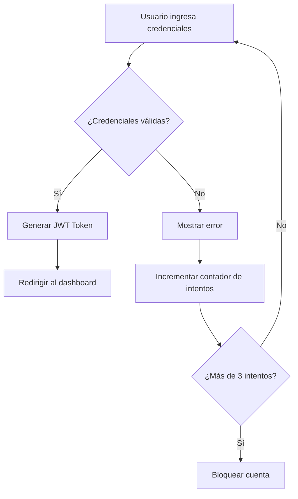

> *(Escribir paso a paso en el editor)*

> Noten varias cosas:
> - `TD` significa Top-Down (de arriba a abajo). También pueden usar `LR` para Left-Right
> - Las llaves `{}` crean diamantes de decisión
> - El texto entre `|pipes|` etiqueta las flechas

🙋 **[PREGUNTA AL PÚBLICO]**

> **¿Qué flujo de su día a día podrían documentar con esto? ¿Un proceso de deploy? ¿Un flujo de aprobación?**

> *(Tomar 2-3 respuestas rápidas)*

> Todos esos son candidatos perfectos. Guarden esas ideas.

**💡 Nota del presentador:** Ir escribiendo el código línea por línea genera más impacto que mostrarlo completo de golpe.

---

### 🔄 SLIDE 8 — Diagramas de Secuencia
**⏱️ Tiempo: 13:00 - 16:00 (3 min)**

---

**DIÁLOGO:**

> Los diagramas de secuencia son **esenciales** para documentar APIs y comunicación entre servicios. Si trabajan con microservicios, este va a ser su mejor amigo.

💻 **[DEMO EN VIVO]**

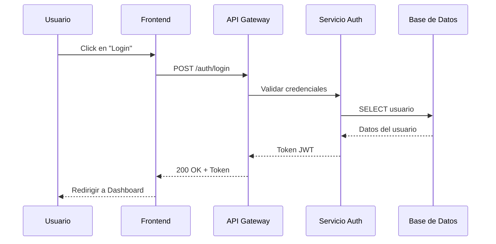

> Observen la sintaxis:
> - `->>` es un mensaje sólido (request)
> - `-->>` es un mensaje punteado (response)
> - `participant` define los actores con alias

> Lo poderoso aquí es que pueden agregar **bloques condicionales**:

```mermaid
    alt Credenciales válidas
        Auth-->>API: Token JWT
    else Credenciales inválidas
        Auth-->>API: 401 Unauthorized
    end
```

> Esto documenta tanto el happy path como los casos de error en un solo diagrama.

🙋 **[PREGUNTA AL PÚBLICO]**

> **¿Cuántos de ustedes documentan las interacciones entre sus microservicios actualmente?** Y los que sí lo hacen: **¿con qué herramienta?**

> *(Esperar respuestas)*

> Con Mermaid, esa documentación puede vivir directamente en el README del repositorio del servicio.

**💡 Nota del presentador:** Este es uno de los diagramas que más "vende" Mermaid a equipos de backend. Enfatizar la integración con documentación de APIs.

---

### 🏗️ SLIDE 9 — Diagramas de Clases
**⏱️ Tiempo: 16:00 - 18:30 (2.5 min)**

---

**DIÁLOGO:**

> Para los que trabajan con orientación a objetos o necesitan documentar modelos de dominio, los diagramas de clases son fundamentales.

💻 **[DEMO EN VIVO]**

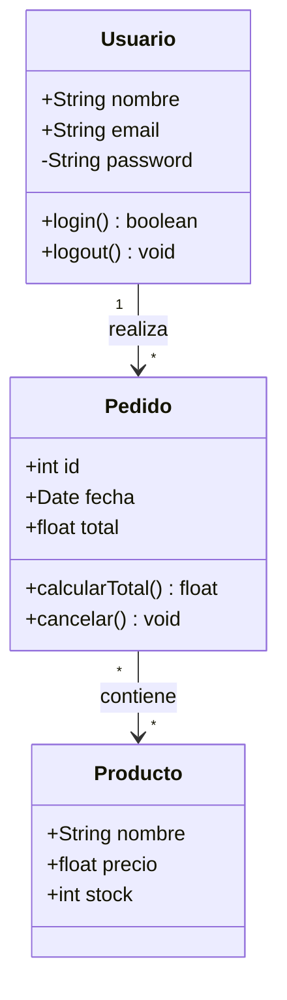

> La sintaxis es muy similar a UML estándar:
> - `+` para público, `-` para privado, `#` para protegido
> - Las relaciones usan cardinalidad: `"1"` a `"*"`
> - El texto después de `:` describe la relación

> No es tan completo como un modelador UML dedicado, pero para documentación rápida de dominio es **perfecto**.

⏸️ **[PAUSA INTERACTIVA]**

> Piensen en su modelo de dominio actual. **¿Cuántas clases principales tiene?** Si son menos de 15-20, Mermaid las maneja sin problema.

---

### 🚦 SLIDE 10 — Diagramas de Estado
**⏱️ Tiempo: 18:30 - 20:30 (2 min)**

---

**DIÁLOGO:**

> Los diagramas de estado son perfectos para documentar **máquinas de estado** — ciclos de vida de entidades, workflows, estados de un pedido, etc.

💻 **[DEMO EN VIVO]**

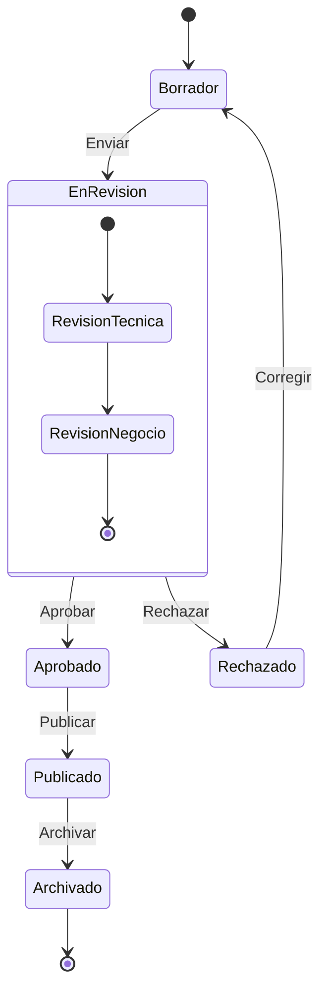

> Puntos clave:
> - `[*]` representa el estado inicial y final
> - Pueden tener **estados compuestos** (estados dentro de estados)
> - Las transiciones llevan etiquetas que describen el evento

> Esto es oro para documentar el ciclo de vida de tickets, pedidos, documentos, o cualquier entidad con estados.

🙋 **[PREGUNTA AL PÚBLICO]**

> **¿Alguien tiene en su proyecto una entidad con más de 5 estados?** ¿Está documentada en algún lado?

> *(Generalmente la respuesta es "no" o "en la cabeza de alguien")*

> Exacto. Con 10 líneas de Mermaid, eso queda documentado para siempre.

---

### 📊 SLIDE 11 — Diagramas de Gantt
**⏱️ Tiempo: 20:30 - 22:30 (2 min)**

---

**DIÁLOGO:**

> Sí, Mermaid también hace Gantt. No va a reemplazar MS Project o Jira, pero para planificaciones rápidas en documentación es muy útil.

💻 **[DEMO EN VIVO]**

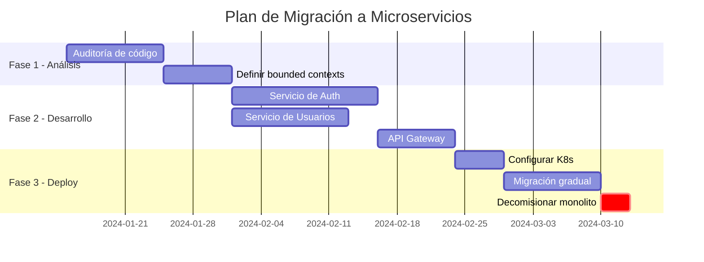

> Lo interesante:
> - `after` crea dependencias entre tareas
> - `crit` marca tareas críticas en rojo
> - Las secciones agrupan visualmente

> Ideal para incluir en documentos de RFC o propuestas técnicas donde necesitan mostrar un timeline.

**💡 Nota del presentador:** Aclarar que no reemplaza herramientas de gestión de proyectos, pero complementa documentación técnica.

---

### 🗄️ SLIDE 12 — Diagramas ER (Entidad-Relación)
**⏱️ Tiempo: 22:30 - 24:30 (2 min)**

---

**DIÁLOGO:**

> Para los que trabajan con bases de datos, los diagramas ER son imprescindibles. Mermaid los soporta con una sintaxis muy limpia.

💻 **[DEMO EN VIVO]**

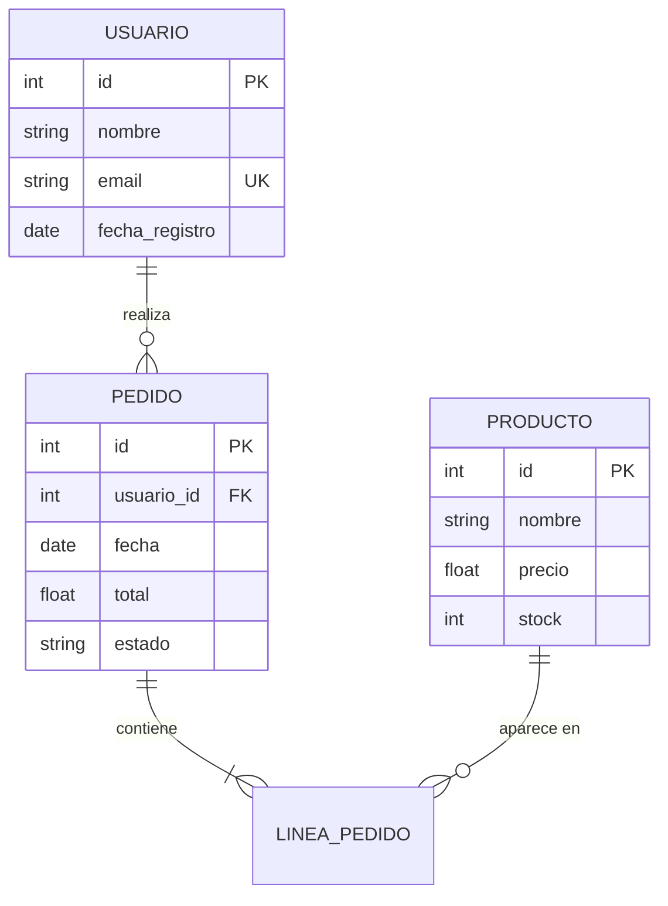

> La notación de cardinalidad usa símbolos:
> - `||` = exactamente uno
> - `o{` = cero o muchos
> - `|{` = uno o muchos
> - `o|` = cero o uno

> Esto es **fantástico** para documentar el esquema de base de datos directamente en el repositorio. Cada vez que hacen una migración, actualizan el diagrama.

🙋 **[PREGUNTA AL PÚBLICO]**

> **¿Quién tiene documentado su esquema de base de datos de forma actualizada?** Y no vale decir "el ORM es la documentación".

> *(Risas)*

> Con Mermaid + Git, el diagrama ER se actualiza en el mismo PR que la migración.

---

### 🥧 SLIDE 13 — Diagramas de Pastel (Pie)
**⏱️ Tiempo: 24:30 - 25:30 (1 min)**

---

**DIÁLOGO:**

> Los diagramas de pastel son los más simples de Mermaid. Útiles para mostrar distribuciones rápidas.

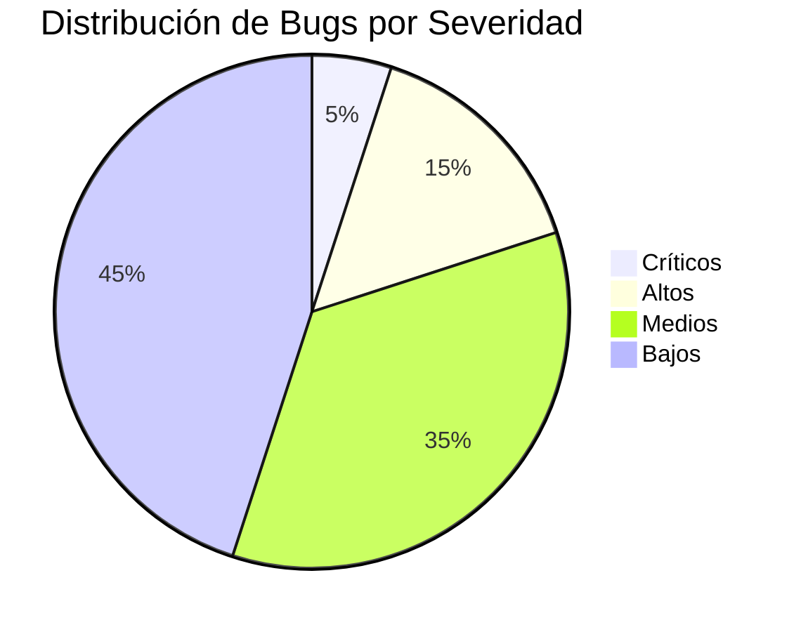

> Tres líneas y tienen un gráfico de pastel. Perfecto para reportes en Markdown, READMEs de proyecto, o dashboards de documentación.

> No es Chart.js, pero para visualizaciones rápidas en documentación cumple perfectamente.

---

### 🧠 SLIDE 14 — Mapas Mentales
**⏱️ Tiempo: 25:30 - 27:00 (1.5 min)**

---

**DIÁLOGO:**

> Los mapas mentales son relativamente nuevos en Mermaid y son geniales para brainstorming o para mostrar la estructura de un sistema.

💻 **[DEMO EN VIVO]**

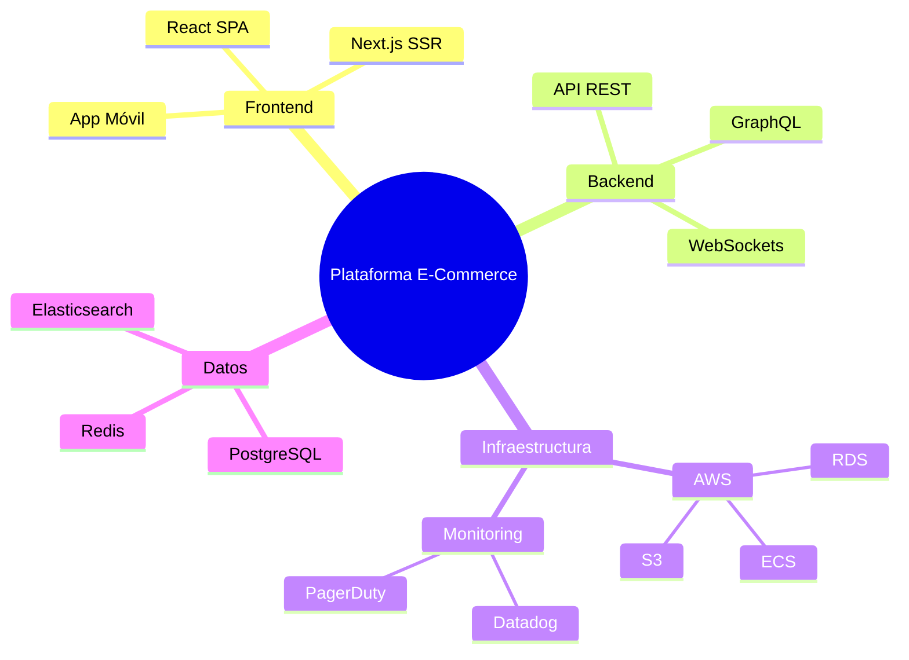

> La indentación define la jerarquía. Es tan simple como escribir un outline.

> Uso ideal: documentar la arquitectura de alto nivel de un sistema, o el alcance de un proyecto en una propuesta.

---

### 📅 SLIDE 15 — Líneas de Tiempo (Timeline)
**⏱️ Tiempo: 27:00 - 28:30 (1.5 min)**

---

**DIÁLOGO:**

> Las líneas de tiempo son perfectas para documentar la evolución de un proyecto o un roadmap.

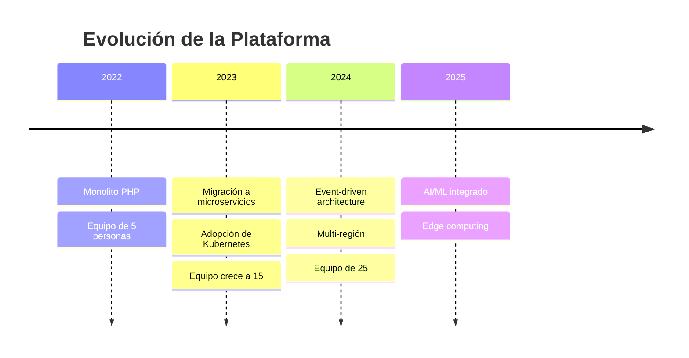

> Super útil para:
> - Documentos de arquitectura que necesitan contexto histórico
> - Presentaciones a stakeholders
> - Onboarding de nuevos miembros del equipo

🔄 **[TRANSICIÓN]**

> Seguimos con más tipos de diagramas especializados...

---

### 🌿 SLIDE 16 — GitGraph
**⏱️ Tiempo: 28:30 - 30:00 (1.5 min)**

---

**DIÁLOGO:**

> Este es uno de mis favoritos. GitGraph permite visualizar estrategias de branching.

💻 **[DEMO EN VIVO]**

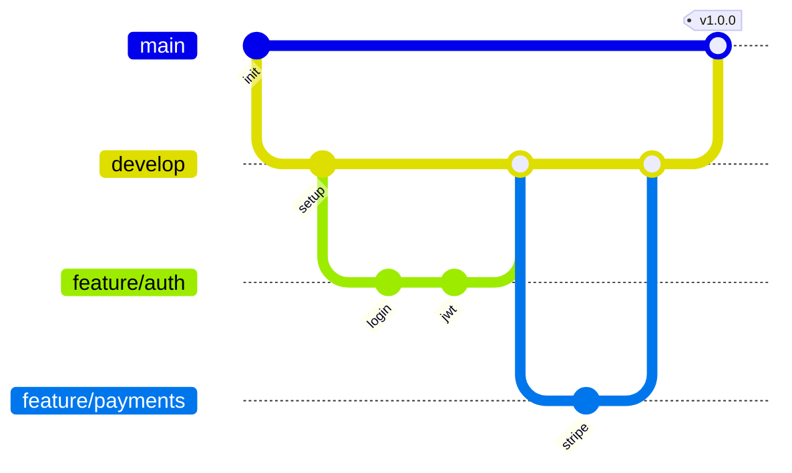

> Esto es **oro** para:
> - Documentar la estrategia de branching del equipo
> - Explicar Git Flow o Trunk-Based Development a nuevos miembros
> - Incluir en guías de contribución

🙋 **[PREGUNTA AL PÚBLICO]**

> **¿Tienen documentada su estrategia de branching?** ¿Dónde vive esa documentación?

> Con Mermaid, puede vivir directamente en el `CONTRIBUTING.md` del repo.

---

### 📐 SLIDE 17 — Diagramas de Cuadrante
**⏱️ Tiempo: 30:00 - 32:00 (2 min)**

---

**DIÁLOGO:**

> Los diagramas de cuadrante son perfectos para matrices de decisión, priorización, o análisis comparativo.

💻 **[DEMO EN VIVO]**


> Casos de uso:
> - Priorización de backlog técnico
> - Evaluación de tecnologías (build vs buy)
> - Matriz de riesgo/impacto

> Cada punto se posiciona con coordenadas `[x, y]` de 0 a 1. Simple y efectivo.

🔄 **[TRANSICIÓN]**

> Ya conocemos los tipos de diagramas. Ahora veamos cómo personalizarlos y hacerlos nuestros.

---

### 🎨 SLIDE 18 — Temas y Personalización
**⏱️ Tiempo: 32:00 - 34:00 (2 min)**

---

**DIÁLOGO:**

> Mermaid viene con temas predefinidos y permite personalización profunda. No tienen que quedarse con los colores por defecto.

💻 **[DEMO EN VIVO]**

> Los temas disponibles son:

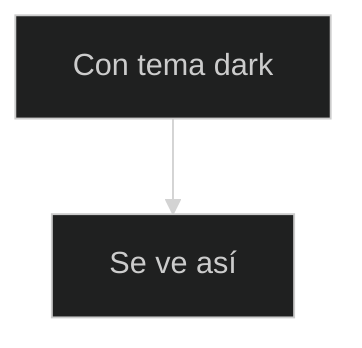

> Temas disponibles: `default`, `dark`, `forest`, `neutral`, `base`

> Pero lo poderoso es la personalización con variables:

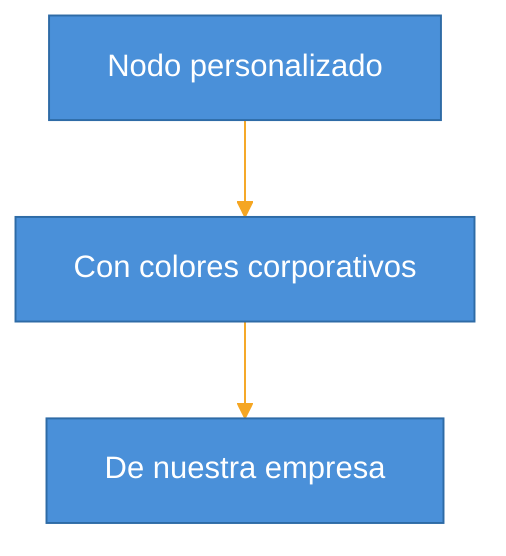

> Esto permite alinear los diagramas con la identidad visual de su empresa. Pueden definir un tema corporativo y reutilizarlo en todos los diagramas.

🙋 **[PREGUNTA AL PÚBLICO]**

> **¿Su empresa tiene una guía de estilo para documentación técnica?** Si la tienen, Mermaid se puede adaptar a ella.

---

### ⚙️ SLIDE 19 — Directivas y Configuración Avanzada
**⏱️ Tiempo: 34:00 - 35:30 (1.5 min)**

---

**DIÁLOGO:**

> Más allá de los temas, Mermaid tiene un sistema de directivas que permite configuración granular.

```mermaid
%%{init: {
  'flowchart': {
    'curve': 'basis',
    'padding': 20,
    'nodeSpacing': 50,
    'rankSpacing': 70,
    'htmlLabels': true
  },
  'sequence': {
    'mirrorActors': false,
    'messageAlign': 'center',
    'actorMargin': 80
  }
}}%%
```

> Las directivas controlan:
> - **Layout**: espaciado, curvas, dirección
> - **Tipografía**: fuentes, tamaños
> - **Comportamiento**: animaciones, interactividad
> - **Seguridad**: nivel de sanitización HTML

> Para equipos, recomiendo crear un archivo de configuración compartido que estandarice el look & feel de todos los diagramas del proyecto.

**💡 Nota del presentador:** No profundizar demasiado aquí. Mencionar que la documentación oficial tiene todas las opciones disponibles.

---

### 🖥️ SLIDE 20 — Editor Interactivo (Mermaid Live Editor)
**⏱️ Tiempo: 35:30 - 37:00 (1.5 min)**

---

**DIÁLOGO:**

> Antes de pasar al ejercicio, déjenme mostrarles su nueva herramienta favorita: el **Mermaid Live Editor**.

💻 **[DEMO EN VIVO]**

> *(Abrir mermaid.live en el navegador)*

> Este editor online les permite:
> - ✅ Escribir y previsualizar diagramas en tiempo real
> - ✅ Cambiar temas al vuelo
> - ✅ Exportar como SVG o PNG
> - ✅ Compartir mediante URL (el código va en la URL)
> - ✅ Ver errores de sintaxis en tiempo real

> La URL es: **mermaid.live** — Guárdenla, la van a usar mucho.

> También tienen opciones locales:
> - **VS Code**: extensión "Mermaid Preview"
> - **IntelliJ**: plugin de Mermaid
> - **CLI**: `mmdc` (mermaid-cli) para generar imágenes desde terminal

🔄 **[TRANSICIÓN]**

> Ahora sí, manos a la obra. Es hora de que ustedes escriban su primer diagrama.

---

### ✏️ SLIDE 21 — Ejercicio Práctico
**⏱️ Tiempo: 37:00 - 42:00 (5 min)**

---

**DIÁLOGO:**

> ¡Llegó el momento! Vamos a hacer un ejercicio juntos.

✏️ **[EJERCICIO]**

> **Instrucciones:**
> 1. Abran **mermaid.live** en su navegador
> 2. Elijan UNO de estos retos (tienen 4 minutos):

> **Reto Nivel 1** (Principiante):
> Crear un diagrama de flujo de su proceso de morning standup:
> ```
> graph TD
>     A[Inicio Standup] --> B[¿Qué hice ayer?]
>     B --> C[¿Qué haré hoy?]
>     C --> D{¿Tengo bloqueos?}
>     D -->|Sí| E[Describir bloqueo]
>     D -->|No| F[Fin]
>     E --> F
> ```

> **Reto Nivel 2** (Intermedio):
> Crear un diagrama de secuencia de una llamada API de su proyecto

> **Reto Nivel 3** (Avanzado):
> Crear un diagrama ER de 3-4 tablas de su base de datos

⏸️ **[PAUSA INTERACTIVA]**

> *(Dar 4 minutos para el ejercicio. Caminar entre la audiencia ayudando.)*

> ¿Quién quiere compartir lo que hizo? No tiene que ser perfecto — lo importante es que vean lo rápido que se puede crear un diagrama.

> *(Pedir 1-2 voluntarios que muestren su pantalla)*

> ¡Excelente! Miren cómo en 4 minutos ya tienen un diagrama funcional. Imaginen lo que pueden hacer con 15 minutos dedicados.

**💡 Nota del presentador:** Este es el momento más importante de la presentación. Asegurarse de que TODOS abran el editor. Caminar y ayudar activamente. Si alguien se atora, ayudarle inmediatamente.

---

### ⚖️ SLIDE 22 — Comparativa con Otras Herramientas
**⏱️ Tiempo: 42:00 - 44:00 (2 min)**

---

**DIÁLOGO:**

> Ahora seamos honestos: Mermaid no es la única opción. Veamos cómo se compara con las alternativas.

> **Draw.io / Diagrams.net:**
> - ✅ Más flexible visualmente
> - ❌ Archivos XML difíciles de versionar
> - ❌ Diffs ilegibles en PRs

> **Lucidchart / Miro:**
> - ✅ Colaboración en tiempo real
> - ❌ De pago
> - ❌ Vendor lock-in
> - ❌ No vive en el repo

> **PlantUML:**
> - ✅ Más tipos de diagramas UML
> - ❌ Necesita servidor Java para renderizar
> - ❌ Sintaxis más verbosa
> - ❌ Menos integraciones nativas

> **Mermaid:**
> - ✅ Nativo en GitHub, GitLab, Notion
> - ✅ Zero dependencies (JavaScript puro)
> - ✅ Sintaxis minimalista
> - ❌ Menos control visual fino
> - ❌ Limitado en diagramas muy complejos

🙋 **[PREGUNTA AL PÚBLICO]**

> **¿Cuál de estas herramientas usan actualmente?** ¿Qué les frustra de ella?

> *(Tomar respuestas y conectar con ventajas de Mermaid)*

---

### 📊 SLIDE 23 — Tabla Comparativa
**⏱️ Tiempo: 44:00 - 45:00 (1 min)**

---

**DIÁLOGO:**

> Aquí tienen la comparativa resumida. Esta slide es para que la fotografíen o la consulten después:

| Criterio | Mermaid | PlantUML | Draw.io | Lucidchart |
|----------|---------|----------|---------|------------|
| Costo | Gratis | Gratis | Gratis | De pago |
| Versionable | ⭐⭐⭐ | ⭐⭐⭐ | ⭐ | ❌ |
| Curva aprendizaje | Baja | Media | Baja | Baja |
| Integración Git | Nativa | Plugin | Manual | ❌ |
| Renderizado | Client-side | Server-side | Client-side | Cloud |
| Colaboración | Via Git | Via Git | Limitada | ⭐⭐⭐ |

> La conclusión: **no hay herramienta perfecta**. Mermaid brilla cuando necesitan diagramas versionables, integrados con código, y mantenibles por el equipo de desarrollo.

🔄 **[TRANSICIÓN]**

> Ahora veamos los casos de uso reales donde Mermaid genera más valor.

---

### 📖 SLIDE 24 — Documentación Técnica
**⏱️ Tiempo: 45:00 - 46:30 (1.5 min)**

---

**DIÁLOGO:**

> El caso de uso número uno: **documentación técnica viva**.

> ¿Dónde encaja Mermaid en su documentación?

> - **README.md** — Diagrama de arquitectura de alto nivel
> - **docs/api/** — Diagramas de secuencia por endpoint
> - **docs/database/** — Diagrama ER actualizado
> - **ADRs** (Architecture Decision Records) — Diagramas que explican decisiones
> - **Runbooks** — Flujos de troubleshooting

> La magia es que GitHub y GitLab renderizan Mermaid **nativamente** en archivos Markdown. No necesitan plugins, no necesitan generar imágenes. Solo escriben el bloque de código con ` ```mermaid ` y listo.

> Esto significa que la documentación se **revisa en el mismo PR que el código**. Si cambias la arquitectura, actualizas el diagrama en el mismo commit.

**💡 Nota del presentador:** Mostrar un ejemplo real de un README con diagrama Mermaid renderizado en GitHub si es posible.

---

### 🤖 SLIDE 25 — Generación con IA
**⏱️ Tiempo: 46:30 - 48:00 (1.5 min)**

---

**DIÁLOGO:**

> Aquí viene algo que va a volarles la cabeza: **la IA puede generar diagramas Mermaid**.

> Como Mermaid es texto plano, cualquier LLM puede generarlo. Prueben esto en ChatGPT, Claude, o Copilot:

> *"Genera un diagrama de secuencia Mermaid para un flujo de pago con tarjeta de crédito que incluya validación 3D Secure"*

> Y les va a devolver un diagrama funcional que pueden pegar directamente en su documentación.

> Pero va más allá:
> - **GitHub Copilot** puede autocompletar diagramas Mermaid en VS Code
> - Pueden crear **prompts estándar** para que la IA genere diagramas consistentes
> - Pueden alimentar la IA con su código y pedirle que genere el diagrama de arquitectura

💻 **[DEMO EN VIVO]**

> *(Si hay tiempo, hacer una demo rápida pidiendo a un LLM que genere un diagrama)*

> El flujo ideal: **código → IA → diagrama Mermaid → documentación**. Semi-automatizado.

🙋 **[PREGUNTA AL PÚBLICO]**

> **¿Alguien ya ha usado IA para generar documentación técnica?** ¿Qué resultados han tenido?

---

### 🤝 SLIDE 26 — Plataformas Colaborativas
**⏱️ Tiempo: 48:00 - 49:00 (1 min)**

---

**DIÁLOGO:**

> Mermaid no vive solo en GitHub. Está integrado en un ecosistema enorme:

> **Renderizado nativo:**
> - GitHub (Markdown)
> - GitLab (Markdown)
> - Notion
> - Obsidian
> - Docusaurus
> - MkDocs (con plugin)

> **Con plugins:**
> - Confluence
> - Jira
> - Slack (bots)
> - Teams

> **Editores:**
> - VS Code (extensión)
> - IntelliJ (plugin)
> - Vim/Neovim (plugin)

> Esto significa que no importa qué stack de herramientas use su equipo — Mermaid probablemente ya tiene integración.

---

### 🚀 SLIDE 27 — CI/CD
**⏱️ Tiempo: 49:00 - 50:30 (1.5 min)**

---

**DIÁLOGO:**

> Ahora algo avanzado pero muy poderoso: **Mermaid en pipelines de CI/CD**.

> ¿Qué pueden automatizar?

> 1. **Validación**: Verificar que los diagramas Mermaid en la documentación son sintácticamente correctos
> 2. **Generación**: Auto-generar diagramas a partir del código (con herramientas de análisis estático)
> 3. **Exportación**: Convertir diagramas a PNG/SVG para documentación estática
> 4. **Detección de drift**: Alertar cuando el código cambia pero el diagrama no

> Ejemplo de GitHub Action:

```yaml
- name: Validate Mermaid diagrams
  uses: mermaid-js/mermaid-cli-action@v1
  with:
    files: '**/*.md'
    output: 'docs/images/'
```

> Imaginen: cada PR que modifica la arquitectura **debe** actualizar el diagrama correspondiente. El CI lo valida automáticamente.

**💡 Nota del presentador:** Este punto es especialmente relevante para líderes técnicos y DevOps. Enfatizar la gobernanza automatizada.

---

### 👋 SLIDE 28 — Onboarding
**⏱️ Tiempo: 50:30 - 51:30 (1 min)**

---

**DIÁLOGO:**

> Uno de los casos de uso con mayor ROI: **onboarding de nuevos miembros del equipo**.

> ¿Cuánto tiempo tarda un nuevo developer en entender la arquitectura de su sistema? ¿Una semana? ¿Dos? ¿Un mes?

> Con diagramas Mermaid actualizados en el repo:
> - **Día 1**: Lee el README con el diagrama de arquitectura general
> - **Día 2**: Explora los diagramas de secuencia de los flujos principales
> - **Día 3**: Revisa el diagrama ER para entender el modelo de datos
> - **Semana 1**: Ya puede contribuir con contexto

> El costo de crear estos diagramas se paga con creces la primera vez que un nuevo miembro se incorpora al equipo.

🙋 **[PREGUNTA AL PÚBLICO]**

> **¿Cuántas personas se han unido a su equipo en el último año?** Multipliquen eso por los días que tardaron en ser productivos. Ese es el costo de no tener documentación visual.

---

### 🏛️ SLIDE 29 — Arquitectura de Microservicios
**⏱️ Tiempo: 51:30 - 52:30 (1 min)**

---

**DIÁLOGO:**

> En arquitecturas de microservicios, Mermaid es especialmente valioso porque:

> 1. **Cada servicio puede tener su propio diagrama** en su repo
> 2. **Los diagramas de secuencia** documentan la comunicación entre servicios
> 3. **Los diagramas de flujo** muestran los event flows
> 4. **Los diagramas ER** documentan la base de datos de cada servicio

> Patrón recomendado:
```
/mi-servicio
  /docs
    architecture.md      ← diagrama de componentes
    api-flows.md         ← diagramas de secuencia
    data-model.md        ← diagrama ER
    state-machines.md    ← diagramas de estado
  /src
    ...
```

> Cada servicio es auto-documentado. No necesitan un wiki centralizado que nadie mantiene.

🔄 **[TRANSICIÓN]**

> Para cerrar la parte técnica, hablemos de mejores prácticas.

---

### 📏 SLIDE 30 — Mejores Prácticas
**⏱️ Tiempo: 52:00 - 53:30 (1.5 min)**

---

**DIÁLOGO:**

> Después de usar Mermaid en producción durante años, estas son las mejores prácticas que recomiendo:

> **1. Mantener diagramas pequeños y enfocados**
> - Un diagrama = un concepto
> - Si tiene más de 15-20 nodos, dividirlo
> - Mejor 3 diagramas simples que 1 complejo

> **2. Usar comentarios**
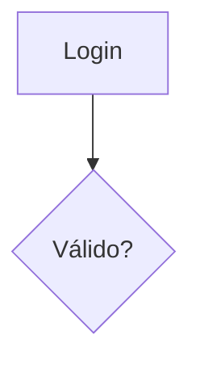

> **3. Documentar junto al código que describen**
> - No en un wiki separado
> - En el mismo directorio o lo más cerca posible

> **4. Incluir en el Definition of Done**
> - ¿Cambiaste la arquitectura? Actualiza el diagrama
> - ¿Nuevo endpoint? Agrega diagrama de secuencia

> **5. Empezar simple, iterar**
> - No intenten documentar todo de golpe
> - Empiecen con el diagrama de arquitectura general
> - Agreguen diagramas conforme surja la necesidad

---

### 🏷️ SLIDE 31 — Convenciones de Nombrado
**⏱️ Tiempo: 53:30 - 54:30 (1 min)**

---

**DIÁLOGO:**

> Las convenciones de nombrado son cruciales para mantener consistencia en equipos grandes:

> **Para nodos:**
```
✅ AuthService, UserDB, APIGateway    (PascalCase para servicios)
✅ validate_token, check_auth         (snake_case para acciones)
❌ a, b, c, node1, node2              (nunca IDs genéricos)
```

> **Para archivos:**
```
✅ architecture-overview.md
✅ auth-flow-sequence.md
✅ user-entity-relationship.md
❌ diagram1.md, nuevo-diagrama.md
```

> **Para relaciones:**
```
✅ A -->|"HTTP POST /login"| B        (describir la interacción)
❌ A --> B                             (sin contexto)
```

> Definan estas convenciones en un `CONTRIBUTING.md` y referencien ejemplos.

---

### 🔧 SLIDE 32 — Mantenimiento y Gobernanza
**⏱️ Tiempo: 54:30 - 55:30 (1 min)**

---

**DIÁLOGO:**

> El mayor riesgo con cualquier documentación es que se desactualice. ¿Cómo prevenirlo con Mermaid?

> **Estrategias de gobernanza:**

> 1. **Code review**: Incluir revisión de diagramas en el checklist de PR
> 2. **CODEOWNERS**: Asignar owners a los archivos de documentación
> 3. **CI validation**: Validar sintaxis automáticamente
> 4. **Freshness checks**: Alertar si un diagrama no se actualiza en X meses
> 5. **Templates**: Proveer templates de diagramas para nuevos servicios

> Ejemplo de CODEOWNERS:
```
/docs/architecture/    @team-architects
/docs/api-flows/       @team-backend
/docs/data-model/      @team-data
```

> La clave: **hacer que mantener los diagramas sea más fácil que no mantenerlos**.

---

### 🔗 SLIDE 33 — Integración con Git
**⏱️ Tiempo: 55:30 - 56:30 (1 min)**

---

**DIÁLOGO:**

> La integración con Git es donde Mermaid realmente brilla sobre las alternativas visuales.

> **Ventajas concretas:**

> 1. **Diffs legibles**: Pueden ver exactamente qué cambió en un diagrama
```diff
- A --> B[Servicio Monolítico]
+ A --> B[API Gateway]
+ B --> C[Servicio Auth]
+ B --> D[Servicio Users]
```

> 2. **Blame**: Saber quién y cuándo modificó cada parte del diagrama
> 3. **Branches**: Proponer cambios de arquitectura en feature branches
> 4. **History**: Ver la evolución del sistema a lo largo del tiempo
> 5. **Merge conflicts**: Se resuelven como cualquier conflicto de texto

> Esto es imposible con herramientas visuales que generan archivos binarios o XML complejo.

⏸️ **[PAUSA INTERACTIVA]**

> Piensen: **¿cuántas veces han tenido un conflicto de merge en un archivo de Draw.io?** Con Mermaid, eso se resuelve en segundos.

---

### ⚡ SLIDE 34 — Rendimiento y Limitaciones
**⏱️ Tiempo: 56:30 - 57:30 (1 min)**

---

**DIÁLOGO:**

> Seamos honestos sobre las limitaciones. Mermaid no es perfecto para todo:

> **Limitaciones conocidas:**
> - 📊 **Diagramas muy grandes** (50+ nodos): El layout automático puede ser caótico
> - 🎨 **Control pixel-perfect**: No pueden posicionar nodos manualmente
> - 🔄 **Diagramas interactivos**: No soporta click handlers nativamente
> - 📱 **Responsive**: Los SVG generados no siempre escalan bien en móvil
> - 🔤 **Texto largo**: Las etiquetas largas pueden romper el layout

> **Recomendaciones:**
> - Si el diagrama tiene más de 20 nodos → dividir en sub-diagramas
> - Si necesitan posicionamiento exacto → usar Draw.io para ese caso específico
> - Si necesitan interactividad → considerar D3.js o herramientas especializadas

> **Rendimiento:**
> - Renderizado client-side: depende del navegador
> - Diagramas complejos pueden tardar 1-2 segundos
> - En CI/CD con `mmdc`: ~500ms por diagrama

> La regla de oro: **Mermaid es para documentación, no para diseño visual**.

---

### ❓ SLIDE 35 — Sesión Q&A
**⏱️ Tiempo: 57:30 - 59:00 (1.5 min)**

---

**DIÁLOGO:**

> Llegamos al momento de preguntas. Abro el micrófono.

🙋 **[PREGUNTA AL PÚBLICO]**

> **¿Qué preguntas tienen? Puede ser sobre sintaxis, casos de uso, integración, lo que sea.**

> *(Responder 2-3 preguntas. Tener preparadas respuestas para preguntas frecuentes:)*

> **Preguntas frecuentes anticipadas:**

> **P: ¿Mermaid soporta diagramas de red/infraestructura?**
> R: No nativamente, pero pueden usar flowcharts con iconos. Para infra compleja, consideren Diagrams (Python) o Draw.io.

> **P: ¿Se puede usar en documentación offline?**
> R: Sí, con la CLI `mmdc` pueden generar SVGs/PNGs. También funciona con Docusaurus, MkDocs, etc.

> **P: ¿Cómo manejan diagramas que son demasiado grandes?**
> R: Dividir en sub-diagramas por bounded context. Un diagrama de alto nivel + diagramas detallados por componente.

> **P: ¿Hay forma de reutilizar componentes entre diagramas?**
> R: No nativamente. Pero pueden usar templates y scripts para generar diagramas con partes comunes.

> **P: ¿Funciona con dark mode?**
> R: Sí, el tema `dark` se adapta. GitHub también renderiza correctamente en dark mode.

**💡 Nota del presentador:** Si no hay preguntas, tener preparadas 2-3 preguntas propias para generar discusión. "¿Alguien ve un caso de uso en su equipo donde podrían empezar mañana?"

---

### 🎬 SLIDE 36 — Cierre y Recursos
**⏱️ Tiempo: 59:00 - 60:00 (1 min)**

---

**DIÁLOGO:**

> Para cerrar, les dejo los recursos clave:

> **📚 Recursos esenciales:**
> - 🌐 **Editor online**: [mermaid.live](https://mermaid.live)
> - 📖 **Documentación oficial**: [mermaid.js.org](https://mermaid.js.org)
> - 💻 **GitHub**: [github.com/mermaid-js/mermaid](https://github.com/mermaid-js/mermaid)
> - 🔌 **VS Code Extension**: "Markdown Preview Mermaid Support"
> - 🛠️ **CLI**: `npm install -g @mermaid-js/mermaid-cli`

> **🎯 Mi reto para ustedes:**

> Esta semana, hagan **UNA** de estas cosas:
> 1. Agreguen un diagrama de arquitectura al README de su proyecto principal
> 2. Documenten un flujo de API con un diagrama de secuencia
> 3. Creen un diagrama ER de su base de datos

> Solo una. Empiecen pequeño. Una vez que lo hagan, van a querer documentar todo con Mermaid.

⏸️ **[PAUSA INTERACTIVA]**

> **Levanten la mano los que se comprometen a crear al menos un diagrama esta semana.**

> *(Esperar manos alzadas)*

> ¡Excelente! Les tomo la palabra.

> Muchas gracias por su tiempo y atención. Los diagramas como código no son el futuro — son el presente. Y ahora ustedes tienen las herramientas para aprovecharlo.

> ¡Gracias! 👏

---

## 📋 CHECKLIST DEL PRESENTADOR

### Antes de la presentación:
- [ ] Verificar que mermaid.live funciona (tener backup offline)
- [ ] Tener VS Code abierto con la extensión de Mermaid
- [ ] Preparar snippets de código para demos en vivo
- [ ] Verificar conexión a internet
- [ ] Tener la presentación en modo pantalla completa
- [ ] Preparar un diagrama "wow" complejo para mostrar si hay tiempo extra

### Durante la presentación:
- [ ] Mantener contacto visual con la audiencia
- [ ] No leer los slides — usar como apoyo visual
- [ ] Caminar durante el ejercicio práctico para ayudar
- [ ] Controlar el tiempo con un reloj visible
- [ ] Si una demo falla, tener screenshots de backup

### Después de la presentación:
- [ ] Compartir el link de la presentación
- [ ] Enviar los recursos por email/Slack
- [ ] Crear un canal de Slack para dudas post-sesión
- [ ] Hacer follow-up en una semana preguntando quién creó su primer diagrama

---

## 🎯 TIPS PARA EL PRESENTADOR

### Manejo del tiempo:
> Si vas adelantado: expandir las demos en vivo y tomar más preguntas
> Si vas atrasado: reducir slides 13-17 a menciones rápidas y acortar la comparativa

### Manejo de la audiencia:
> - Si la audiencia es muy técnica: profundizar en CI/CD y configuración avanzada
> - Si la audiencia es mixta: enfocarse en casos de uso y beneficios de negocio
> - Si hay poca participación: hacer preguntas de sí/no con mano alzada

### Errores comunes a evitar:
> - ❌ No intentar cubrir TODOS los tipos de diagramas en detalle
> - ❌ No hacer demos demasiado complejas que puedan fallar
> - ❌ No asumir que todos conocen Git o Markdown
> - ❌ No olvidar el ejercicio práctico — es lo que más recuerdan

### Frases de transición útiles:
> - "Esto nos lleva naturalmente a..."
> - "Ahora que entendemos X, veamos cómo se aplica a..."
> - "¿Recuerdan cuando mencioné...? Aquí es donde cobra sentido"
> - "Esto es genial en teoría, pero veámoslo en la práctica"

---

## 📊 MÉTRICAS DE ÉXITO DE LA PRESENTACIÓN

| Métrica | Objetivo |
|---------|----------|
| Asistentes que abren mermaid.live | > 80% |
| Asistentes que completan el ejercicio | > 60% |
| Preguntas durante la sesión | > 5 |
| Compromisos de crear un diagrama | > 50% |
| NPS post-sesión | > 8/10 |

---

*Documento generado para la presentación interactiva de Mermaid. Duración: 60 minutos. 36 slides.*
*Última actualización: 2024*
