# 🎤 Guión de Diálogo — Presentación Interactiva de Mermaid

## 📋 Información General

| Campo | Detalle |
|-------|---------|
| **Duración total** | 60 minutos |
| **Número de slides** | 34 |
| **Formato** | Presentación interactiva con demos en vivo |
| **Audiencia** | Desarrolladores, arquitectos, líderes técnicos |
| **Materiales necesarios** | Laptop con editor, navegador con Mermaid Live Editor abierto |

---

## 🎯 Leyenda de Marcadores Interactivos

| Emoji | Significado |
|-------|-------------|
| 🙋 [PREGUNTA AL PÚBLICO] | Momento de interacción directa con la audiencia |
| 💻 [DEMO EN VIVO] | Demostración práctica en tiempo real |
| ⏸️ [PAUSA INTERACTIVA] | Momento para reflexión o actividad breve |
| ✏️ [EJERCICIO] | Actividad práctica para los asistentes |
| 🔄 [TRANSICIÓN] | Conexión entre temas |

---

## ⏱️ Distribución del Tiempo

| Sección | Slides | Tiempo | Minutos |
|---------|--------|--------|---------|
| Introducción y Fundamentos | 1-6 | 0:00 - 10:00 | 10 min |
| Tipos de Diagramas | 7-13 | 10:00 - 25:00 | 15 min |
| Diagramas Avanzados | 14-17 | 25:00 - 32:00 | 7 min |
| Configuración y Temas | 18-19 | 32:00 - 35:00 | 3 min |
| Editor Interactivo (Ejercicio) | 20 | 35:00 - 40:00 | 5 min |
| Comparativa | 21-22 | 40:00 - 43:00 | 3 min |
| Casos de Uso | 23-28 | 43:00 - 52:00 | 9 min |
| Mejores Prácticas | 29-33 | 52:00 - 58:00 | 6 min |
| Cierre | 34 | 58:00 - 60:00 | 2 min |

---

## 📝 GUIÓN COMPLETO

---

### 🎬 SLIDE 1 — intro (Título)
**"Mermaid: Diagramación Inteligente"**
**⏱️ Tiempo: 0:00 - 2:00 (2 min)**

---

**DIÁLOGO:**

> Buenos días/tardes a todos. Bienvenidos a esta sesión sobre **Mermaid** — la herramienta que va a transformar la forma en que documentamos y comunicamos arquitectura en nuestros equipos.

> Mi nombre es [NOMBRE] y hoy vamos a hacer algo diferente: no solo voy a mostrarles slides, sino que vamos a **escribir diagramas juntos, en vivo**, y van a salir de aquí creando sus propios diagramas como código.

🙋 **[PREGUNTA AL PÚBLICO]**

> Antes de arrancar, una pregunta rápida a mano alzada: **¿Cuántos de ustedes han usado alguna vez una herramienta visual como Draw.io, Lucidchart o Visio para crear diagramas?**

> *(Esperar respuestas)*

> Perfecto, casi todos. Y ahora: **¿Cuántos han tenido el problema de que esos diagramas se desactualizan y nadie los mantiene?**

> *(Risas y manos alzadas)*

> Exacto. Ese es precisamente el problema que Mermaid resuelve. Vamos a ver cómo.

**💡 Nota del presentador:** Establecer conexión emocional con el dolor compartido. El humor sobre diagramas desactualizados siempre funciona. Hacer contacto visual con la audiencia.

---

### 📑 SLIDE 2 — table-of-contents (Índice)
**"Índice de la Presentación"**
**⏱️ Tiempo: 2:00 - 3:00 (1 min)**

---

**DIÁLOGO:**

> Este es nuestro mapa de ruta para la próxima hora. Vamos a cubrir bastante terreno, pero no se preocupen — la presentación está diseñada para ser práctica y dinámica.

> Arrancaremos con los **fundamentos**, luego exploraremos los tipos de diagramas — desde los básicos hasta los avanzados —, haremos un **ejercicio práctico** juntos, veremos casos de uso reales, y cerraremos con mejores prácticas.

> Lo más importante: **esta es una sesión interactiva**. Si tienen preguntas, levanten la mano en cualquier momento. No esperen al final.

🔄 **[TRANSICIÓN]**

> Empecemos por lo básico: ¿qué es exactamente Mermaid?

---

### 🧩 SLIDE 3 — what-is-mermaid (Fundamentos)
**"¿Qué es Mermaid?"**
**⏱️ Tiempo: 3:00 - 5:30 (2.5 min)**

---

**DIÁLOGO:**

> Mermaid es una herramienta de **diagramación basada en texto**. En lugar de arrastrar cajitas con el mouse, escribes código — texto plano — y Mermaid lo convierte en diagramas visuales.

> Piénsenlo como "Markdown para diagramas". Así como Markdown nos permite escribir documentación formateada sin un editor visual, Mermaid nos permite crear diagramas sin herramientas gráficas.

💻 **[DEMO EN VIVO]**

> Déjenme mostrarles algo rápido. Voy a escribir esto:

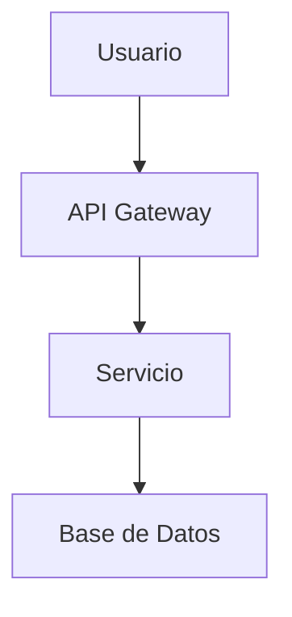

> *(Escribir en vivo en el editor)*

> Miren: con 4 líneas de texto, tenemos un diagrama de arquitectura. Sin mouse, sin alinear cajitas, sin perder 20 minutos ajustando flechas.

🙋 **[PREGUNTA AL PÚBLICO]**

> **¿Alguien puede pensar en una ventaja inmediata de tener diagramas como texto plano?**

> *(Esperar respuestas: versionable, diff en PRs, automatizable...)*

> ¡Exacto! Pueden vivir en Git, se pueden revisar en Pull Requests, y se actualizan junto con el código.

**💡 Nota del presentador:** La demo en vivo es crucial aquí. El "wow moment" de ver texto convertirse en diagrama instantáneamente es lo que engancha a la audiencia. Tener el editor listo antes de empezar.

---

### ⌨️ SLIDE 4 — basic-syntax (Fundamentos)
**"Sintaxis Básica de Mermaid"**
**⏱️ Tiempo: 5:30 - 7:30 (2 min)**

---

**DIÁLOGO:**

> La sintaxis de Mermaid es intencionalmente simple. Veamos los elementos fundamentales:

> **Primero**, siempre declaramos el tipo de diagrama: `graph`, `sequenceDiagram`, `classDiagram`, etc.

> **Segundo**, definimos nodos con identificadores y etiquetas — cada forma tiene un significado visual diferente:

```
A[Rectángulo]    → procesos
B(Redondeado)    → inicio/fin
C{Diamante}      → decisiones
D[(Cilindro)]    → bases de datos
```

> **Tercero**, conectamos nodos con flechas:

```
-->   flecha normal
---   línea sin flecha
-.->  línea punteada
==>   flecha gruesa
```

> Es como aprender un mini-lenguaje, pero les prometo que en 10 minutos ya van a estar escribiendo diagramas solos.

⏸️ **[PAUSA INTERACTIVA]**

> Tómense 10 segundos para pensar: **¿qué diagrama de su proyecto actual les gustaría poder generar con texto?** Guarden esa idea, la vamos a usar más adelante en el ejercicio.

**💡 Nota del presentador:** Plantar la semilla del ejercicio práctico desde temprano mantiene la atención y genera expectativa.

---

### ✅ SLIDE 5 — advantages (Fundamentos)
**"Ventajas de Mermaid"**
**⏱️ Tiempo: 7:30 - 8:30 (1 min)**

---

**DIÁLOGO:**

> Resumamos las ventajas clave de Mermaid en una palabra para cada una:

> 1. **Versionable** — vive en Git como cualquier archivo de código
> 2. **Reproducible** — el mismo texto siempre genera el mismo diagrama
> 3. **Colaborativo** — se revisa en PRs como código
> 4. **Portable** — funciona en GitHub, GitLab, Notion, Confluence, VS Code...
> 5. **Mantenible** — actualizar un diagrama es editar texto, no rediseñar
> 6. **Automatizable** — se puede generar con scripts, CI/CD, o IA

> La clave es esta: **los diagramas dejan de ser artefactos estáticos y se convierten en documentación viva**.

🔄 **[TRANSICIÓN]**

> Ahora que entendemos el "qué" y el "por qué", veamos brevemente el "cómo" funciona por dentro.

---

### ⚙️ SLIDE 6 — rendering-architecture (Fundamentos)
**"Arquitectura de Renderizado"**
**⏱️ Tiempo: 8:30 - 10:00 (1.5 min)**

---

**DIÁLOGO:**

> Para los curiosos técnicos — y sé que aquí hay varios — veamos cómo Mermaid convierte texto en gráficos.

> El proceso tiene 4 etapas:

> 1. **Parsing** — Un parser analiza el texto y construye un AST (Árbol de Sintaxis Abstracta)
> 2. **Procesamiento** — Se resuelven las relaciones, se calculan layouts
> 3. **Renderizado** — Se genera SVG usando la librería D3.js
> 4. **Presentación** — El SVG se inyecta en el DOM del navegador

> ¿Por qué importa esto? Porque significa que Mermaid es **100% client-side**. No necesita servidor. Se ejecuta en el navegador. Esto lo hace ideal para documentación estática, GitHub Pages, o cualquier sitio web.

> También significa que tiene algunas limitaciones — que veremos al final — pero para el 90% de los casos de uso en documentación técnica, es más que suficiente.

🔄 **[TRANSICIÓN]**

> Ahora viene la parte divertida. Vamos a explorar los **tipos de diagramas** que Mermaid soporta. Prepárense porque vamos a ir rápido pero con demos en vivo.

**💡 Nota del presentador:** No profundizar demasiado en detalles técnicos. El objetivo es dar contexto, no una clase de compiladores.

---

### 🔀 SLIDE 7 — flowchart (Tipos de Diagramas)
**"Diagramas de Flujo (Flowchart)"**
**⏱️ Tiempo: 10:00 - 13:00 (3 min)**

---

**DIÁLOGO:**

> El diagrama de flujo es el pan de cada día. Es probablemente el tipo que más van a usar.

💻 **[DEMO EN VIVO]**

> Vamos a construir uno juntos. Imaginen un flujo de autenticación:

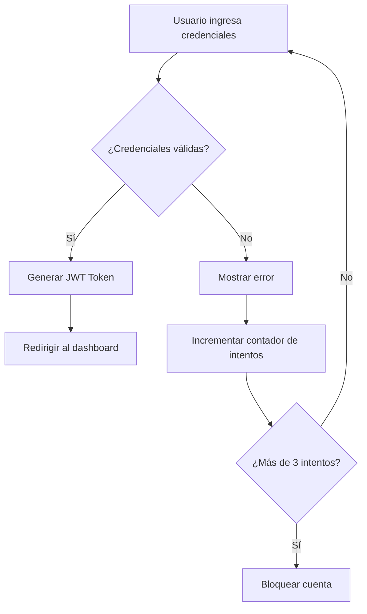

> *(Escribir paso a paso en el editor)*

> Noten varias cosas:
> - `TD` significa Top-Down (de arriba a abajo). También pueden usar `LR` para Left-Right
> - Las llaves `{}` crean diamantes de decisión
> - El texto entre `|pipes|` etiqueta las flechas

🙋 **[PREGUNTA AL PÚBLICO]**

> **¿Qué flujo de su día a día podrían documentar con esto? ¿Un proceso de deploy? ¿Un flujo de aprobación?**

> *(Tomar 2-3 respuestas rápidas)*

> Todos esos son candidatos perfectos. Guarden esas ideas para el ejercicio.

**💡 Nota del presentador:** Ir escribiendo el código línea por línea genera más impacto que mostrarlo completo de golpe. Dejar que la audiencia vea el diagrama construirse.

---

### 🔄 SLIDE 8 — sequence-diagram (Tipos de Diagramas)
**"Diagramas de Secuencia"**
**⏱️ Tiempo: 13:00 - 15:30 (2.5 min)**

---

**DIÁLOGO:**

> Los diagramas de secuencia son **esenciales** para documentar APIs y comunicación entre servicios. Si trabajan con microservicios, este va a ser su mejor amigo.

💻 **[DEMO EN VIVO]**

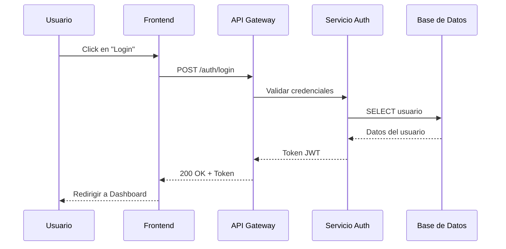

> Observen la sintaxis:
> - `->>` es un mensaje sólido (request)
> - `-->>` es un mensaje punteado (response)
> - `participant` define los actores con alias

> Lo poderoso es que pueden agregar **bloques condicionales** con `alt`/`else`/`end` para documentar happy path y errores en un solo diagrama.

🙋 **[PREGUNTA AL PÚBLICO]**

> **¿Cuántos de ustedes documentan las interacciones entre sus microservicios actualmente?** Y los que sí: **¿con qué herramienta?**

> Con Mermaid, esa documentación puede vivir directamente en el README del repositorio del servicio.

**💡 Nota del presentador:** Este es uno de los diagramas que más "vende" Mermaid a equipos de backend. Enfatizar la integración con documentación de APIs.

---

### 🏗️ SLIDE 9 — class-diagram (Tipos de Diagramas)
**"Diagramas de Clases"**
**⏱️ Tiempo: 15:30 - 17:30 (2 min)**

---

**DIÁLOGO:**

> Para los que trabajan con orientación a objetos o necesitan documentar modelos de dominio, los diagramas de clases son fundamentales.

💻 **[DEMO EN VIVO]**

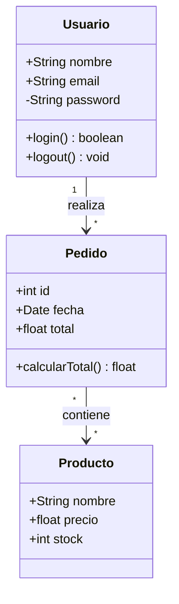

> La sintaxis es muy similar a UML estándar:
> - `+` para público, `-` para privado, `#` para protegido
> - Las relaciones usan cardinalidad: `"1"` a `"*"`
> - El texto después de `:` describe la relación

> No es tan completo como un modelador UML dedicado, pero para documentación rápida de dominio es **perfecto**.

⏸️ **[PAUSA INTERACTIVA]**

> Piensen en su modelo de dominio actual. **¿Cuántas clases principales tiene?** Si son menos de 15-20, Mermaid las maneja sin problema.

---

### 🚦 SLIDE 10 — state-diagram (Tipos de Diagramas)
**"Diagramas de Estado"**
**⏱️ Tiempo: 17:30 - 19:30 (2 min)**

---

**DIÁLOGO:**

> Los diagramas de estado son perfectos para documentar **máquinas de estado** — ciclos de vida de entidades, workflows, estados de un pedido, etc.

💻 **[DEMO EN VIVO]**

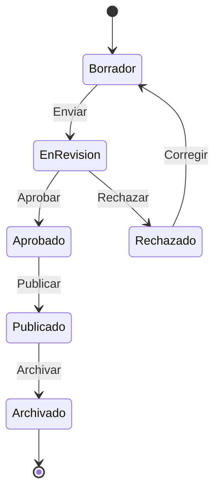

> Puntos clave:
> - `[*]` representa el estado inicial y final
> - Pueden tener **estados compuestos** (estados dentro de estados)
> - Las transiciones llevan etiquetas que describen el evento

> Esto es oro para documentar el ciclo de vida de tickets, pedidos, documentos, o cualquier entidad con estados.

🙋 **[PREGUNTA AL PÚBLICO]**

> **¿Alguien tiene en su proyecto una entidad con más de 5 estados?** ¿Está documentada en algún lado?

> *(Generalmente la respuesta es "no" o "en la cabeza de alguien")*

> Exacto. Con 10 líneas de Mermaid, eso queda documentado para siempre.

---

### 📊 SLIDE 11 — gantt-diagram (Tipos de Diagramas)
**"Diagramas de Gantt"**
**⏱️ Tiempo: 19:30 - 21:00 (1.5 min)**

---

**DIÁLOGO:**

> Sí, Mermaid también hace Gantt. No va a reemplazar Jira, pero para planificaciones rápidas en documentación es muy útil.

💻 **[DEMO EN VIVO]**

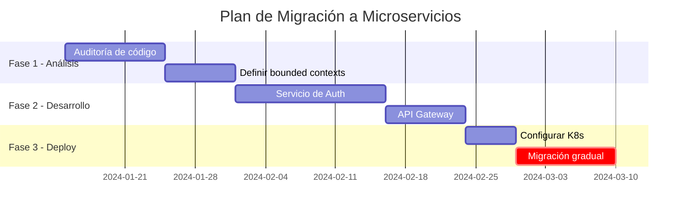

> Lo interesante:
> - `after` crea dependencias entre tareas
> - `crit` marca tareas críticas en rojo
> - Las secciones agrupan visualmente

> Ideal para incluir en documentos de RFC o propuestas técnicas donde necesitan mostrar un timeline.

**💡 Nota del presentador:** Aclarar que no reemplaza herramientas de gestión de proyectos, pero complementa documentación técnica.

---

### 🗄️ SLIDE 12 — er-diagram (Tipos de Diagramas)
**"Diagramas Entidad-Relación"**
**⏱️ Tiempo: 21:00 - 23:00 (2 min)**

---

**DIÁLOGO:**

> Para los que trabajan con bases de datos, los diagramas ER son imprescindibles. Mermaid los soporta con una sintaxis muy limpia.

💻 **[DEMO EN VIVO]**

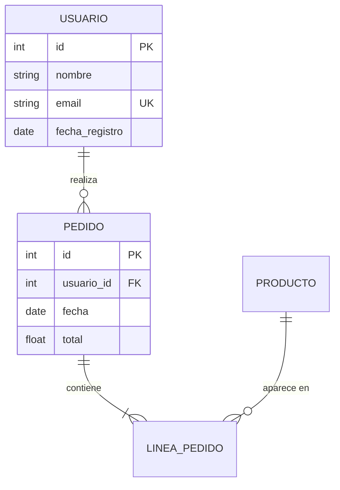

> La notación de cardinalidad usa símbolos:
> - `||` = exactamente uno
> - `o{` = cero o muchos
> - `|{` = uno o muchos

> Esto es **fantástico** para documentar el esquema de base de datos directamente en el repositorio. Cada vez que hacen una migración, actualizan el diagrama.

🙋 **[PREGUNTA AL PÚBLICO]**

> **¿Quién tiene documentado su esquema de base de datos de forma actualizada?** Y no vale decir "el ORM es la documentación".

> *(Risas)*

> Con Mermaid + Git, el diagrama ER se actualiza en el mismo PR que la migración.

---

### 🥧 SLIDE 13 — pie-chart (Tipos de Diagramas)
**"Diagramas de Pastel"**
**⏱️ Tiempo: 23:00 - 25:00 (2 min)**

---

**DIÁLOGO:**

> Los diagramas de pastel son los más simples de Mermaid. Útiles para mostrar distribuciones rápidas.

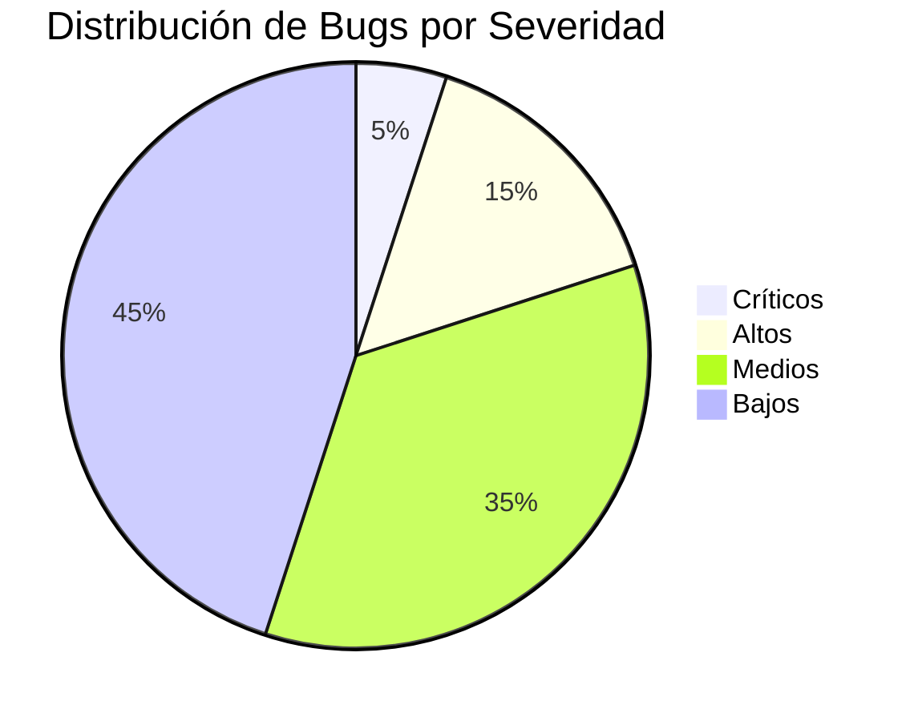

> Tres líneas y tienen un gráfico de pastel. Perfecto para reportes en Markdown, READMEs de proyecto, o dashboards de documentación.

> No es Chart.js, pero para visualizaciones rápidas en documentación cumple perfectamente.

🔄 **[TRANSICIÓN]**

> Esos son los diagramas fundamentales. Ahora vamos con los tipos más avanzados y especializados que Mermaid ha incorporado recientemente.

**💡 Nota del presentador:** Hacer una pausa natural aquí. Preguntar si hay dudas sobre los diagramas básicos antes de avanzar.

---

### 🧠 SLIDE 14 — mindmap-diagram (Diagramas Avanzados)
**"Mapas Mentales (Mindmap)"**
**⏱️ Tiempo: 25:00 - 26:30 (1.5 min)**

---

**DIÁLOGO:**

> Los mapas mentales son relativamente nuevos en Mermaid y son geniales para brainstorming o para mostrar la estructura de un sistema.

💻 **[DEMO EN VIVO]**

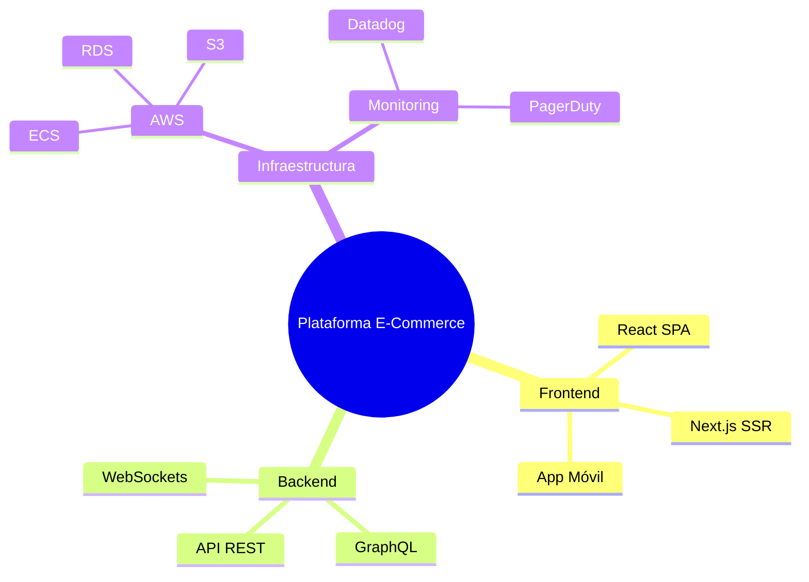

> La indentación define la jerarquía. Es tan simple como escribir un outline.

> Uso ideal: documentar la arquitectura de alto nivel de un sistema, o el alcance de un proyecto en una propuesta.

⏸️ **[PAUSA INTERACTIVA]**

> **¿Pueden pensar en un mapa mental que les sería útil en su proyecto actual?** Tal vez la estructura de sus microservicios, o las dependencias de su equipo.

---

### 📅 SLIDE 15 — timeline-diagram (Diagramas Avanzados)
**"Líneas de Tiempo (Timeline)"**
**⏱️ Tiempo: 26:30 - 28:00 (1.5 min)**

---

**DIÁLOGO:**

> Las líneas de tiempo son perfectas para documentar la evolución de un proyecto o un roadmap.

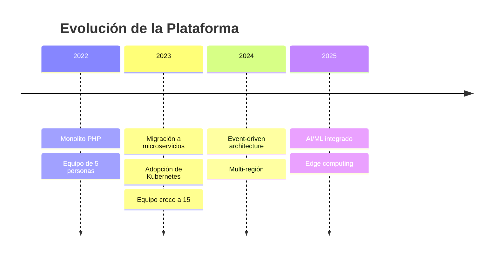

> Super útil para:
> - Documentos de arquitectura que necesitan contexto histórico
> - Presentaciones a stakeholders
> - Onboarding de nuevos miembros del equipo

> La sintaxis es mínima: año, dos puntos, y los eventos. Así de simple.

---

### 🌿 SLIDE 16 — gitgraph-diagram (Diagramas Avanzados)
**"Diagramas Git (GitGraph)"**
**⏱️ Tiempo: 28:00 - 30:00 (2 min)**

---

**DIÁLOGO:**

> Este es uno de mis favoritos. GitGraph permite visualizar estrategias de branching.

💻 **[DEMO EN VIVO]**

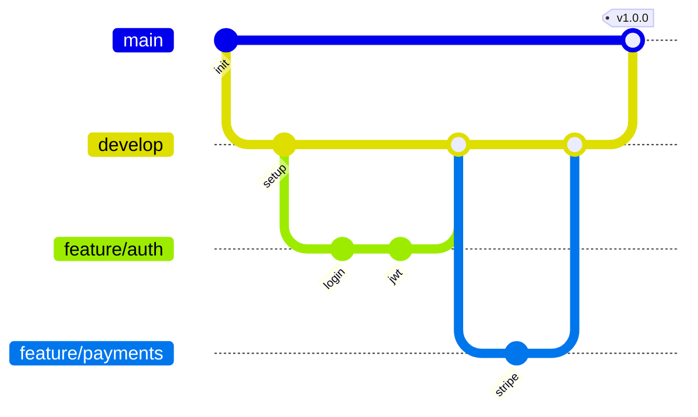

> Esto es **oro** para:
> - Documentar la estrategia de branching del equipo
> - Explicar Git Flow o Trunk-Based Development a nuevos miembros
> - Incluir en guías de contribución (`CONTRIBUTING.md`)

🙋 **[PREGUNTA AL PÚBLICO]**

> **¿Tienen documentada su estrategia de branching?** ¿Dónde vive esa documentación?

> Con Mermaid, puede vivir directamente en el repo, renderizada y siempre actualizada.

---

### 📐 SLIDE 17 — quadrant-diagram (Diagramas Avanzados)
**"Diagramas de Cuadrante"**
**⏱️ Tiempo: 30:00 - 32:00 (2 min)**

---

**DIÁLOGO:**

> Los diagramas de cuadrante son perfectos para matrices de decisión, priorización, o análisis comparativo.

💻 **[DEMO EN VIVO]**

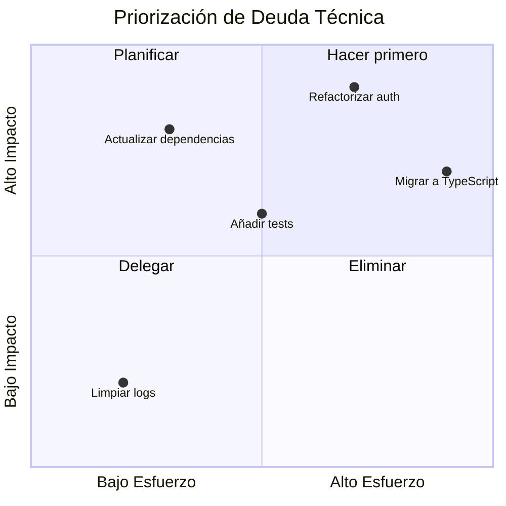

> Casos de uso:
> - Priorización de backlog técnico
> - Evaluación de tecnologías (build vs buy)
> - Matriz de riesgo/impacto

> Cada punto se posiciona con coordenadas `[x, y]` de 0 a 1. Simple y efectivo.

🔄 **[TRANSICIÓN]**

> Ya conocemos todos los tipos de diagramas. Ahora veamos cómo personalizarlos y hacerlos nuestros.

**💡 Nota del presentador:** Si la audiencia se ve cansada, este es buen momento para una micro-pausa de 30 segundos. "Estiren las piernas, tomen agua."

---

### 🎨 SLIDE 18 — themes-config (Configuración y Temas)
**"Temas y Personalización"**
**⏱️ Tiempo: 32:00 - 33:30 (1.5 min)**

---

**DIÁLOGO:**

> Mermaid viene con temas predefinidos y permite personalización profunda. No tienen que quedarse con los colores por defecto.

> Los temas disponibles son: `default`, `dark`, `forest`, `neutral`, `base`

💻 **[DEMO EN VIVO]**

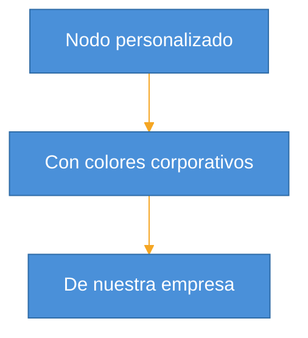

> Esto permite alinear los diagramas con la identidad visual de su empresa. Pueden definir un tema corporativo y reutilizarlo en todos los diagramas.

🙋 **[PREGUNTA AL PÚBLICO]**

> **¿Su empresa tiene una guía de estilo para documentación técnica?** Si la tienen, Mermaid se puede adaptar a ella perfectamente.

---

### ⚙️ SLIDE 19 — directives-config (Configuración y Temas)
**"Directivas y Configuración Avanzada"**
**⏱️ Tiempo: 33:30 - 35:00 (1.5 min)**

---

**DIÁLOGO:**

> Más allá de los temas, Mermaid tiene un sistema de directivas que permite configuración granular.

```mermaid
%%{init: {
  'flowchart': {
    'curve': 'basis',
    'padding': 20,
    'nodeSpacing': 50,
    'rankSpacing': 70
  },
  'sequence': {
    'mirrorActors': false,
    'actorMargin': 80
  }
}}%%
```

> Las directivas controlan:
> - **Layout**: espaciado, curvas, dirección
> - **Tipografía**: fuentes, tamaños
> - **Comportamiento**: animaciones, interactividad
> - **Seguridad**: nivel de sanitización HTML

> Para equipos, recomiendo crear un archivo de configuración compartido que estandarice el look & feel de todos los diagramas del proyecto.

🔄 **[TRANSICIÓN]**

> Ahora sí, manos a la obra. Es hora de que ustedes escriban su primer diagrama.

**💡 Nota del presentador:** No profundizar demasiado en directivas. Mencionar que la documentación oficial tiene todas las opciones. El objetivo es que sepan que existe.

---

### 🖥️ SLIDE 20 — editor-playground (Editor Interactivo)
**"Experimenta con Mermaid"**
**⏱️ Tiempo: 35:00 - 40:00 (5 min)**

---

**DIÁLOGO:**

> ¡Llegó el momento! Vamos a hacer un ejercicio práctico juntos.

> Primero, déjenme presentarles el **Mermaid Live Editor**: **mermaid.live**

> Este editor online les permite:
> - ✅ Escribir y previsualizar diagramas en tiempo real
> - ✅ Cambiar temas al vuelo
> - ✅ Exportar como SVG o PNG
> - ✅ Compartir mediante URL
> - ✅ Ver errores de sintaxis en tiempo real

✏️ **[EJERCICIO]**

> **Instrucciones:**
> 1. Abran **mermaid.live** en su navegador (o usen el editor integrado en esta presentación)
> 2. Elijan UNO de estos retos (tienen 4 minutos):

> **Reto Nivel 1** (Principiante):
> Crear un diagrama de flujo de su proceso de morning standup

> **Reto Nivel 2** (Intermedio):
> Crear un diagrama de secuencia de una llamada API de su proyecto

> **Reto Nivel 3** (Avanzado):
> Crear un diagrama ER de 3-4 tablas de su base de datos

⏸️ **[PAUSA INTERACTIVA — 4 minutos]**

> *(Dar 4 minutos para el ejercicio. Caminar entre la audiencia ayudando.)*

> ¿Quién quiere compartir lo que hizo? No tiene que ser perfecto — lo importante es que vean lo rápido que se puede crear un diagrama.

> *(Pedir 1-2 voluntarios que muestren su pantalla)*

> ¡Excelente! Miren cómo en 4 minutos ya tienen un diagrama funcional. Imaginen lo que pueden hacer con 15 minutos dedicados.

**💡 Nota del presentador:** Este es el momento más importante de la presentación. Asegurarse de que TODOS abran el editor. Caminar y ayudar activamente. Si alguien se atora, ayudarle inmediatamente. Tener snippets de ejemplo listos para copiar/pegar si alguien se bloquea.

---

### ⚖️ SLIDE 21 — comparison (Comparativa)
**"Mermaid vs Otras Herramientas"**
**⏱️ Tiempo: 40:00 - 41:30 (1.5 min)**

---

**DIÁLOGO:**

> Ahora seamos honestos: Mermaid no es la única opción. Veamos cómo se compara con las alternativas.

> **Draw.io / Diagrams.net:**
> - ✅ Más flexible visualmente
> - ❌ Archivos XML difíciles de versionar, diffs ilegibles

> **Lucidchart / Miro:**
> - ✅ Colaboración en tiempo real
> - ❌ De pago, vendor lock-in, no vive en el repo

> **PlantUML:**
> - ✅ Más tipos de diagramas UML
> - ❌ Necesita servidor Java, sintaxis más verbosa

> **Mermaid:**
> - ✅ Nativo en GitHub/GitLab, zero dependencies, sintaxis minimalista
> - ❌ Menos control visual fino, limitado en diagramas muy complejos

> La conclusión: **no hay herramienta perfecta**. Mermaid brilla cuando necesitan diagramas versionables, integrados con código, y mantenibles por el equipo de desarrollo.

🙋 **[PREGUNTA AL PÚBLICO]**

> **¿Cuál de estas herramientas usan actualmente?** ¿Qué les frustra de ella?

> *(Tomar respuestas y conectar con ventajas de Mermaid)*

---

### 📊 SLIDE 22 — comparison-table (Comparativa)
**"Tabla Comparativa Detallada"**
**⏱️ Tiempo: 41:30 - 43:00 (1.5 min)**

---

**DIÁLOGO:**

> Aquí tienen la comparativa resumida. Esta slide es para que la fotografíen o la consulten después:

| Criterio | Mermaid | PlantUML | Draw.io | Lucidchart |
|----------|---------|----------|---------|------------|
| Costo | Gratis | Gratis | Gratis | De pago |
| Versionable | ⭐⭐⭐ | ⭐⭐⭐ | ⭐ | ❌ |
| Curva aprendizaje | Baja | Media | Baja | Baja |
| Integración Git | Nativa | Plugin | Manual | ❌ |
| Renderizado | Client-side | Server-side | Client-side | Cloud |
| Colaboración | Via Git | Via Git | Limitada | ⭐⭐⭐ |

> Mi recomendación: usen Mermaid como **herramienta principal** para documentación en repositorios, y complementen con Draw.io o Lucidchart solo cuando necesiten diagramas muy complejos o colaboración visual en tiempo real.

🔄 **[TRANSICIÓN]**

> Ahora veamos los casos de uso reales donde Mermaid genera más valor en el día a día.

---

### 📖 SLIDE 23 — use-case-docs (Casos de Uso)
**"Documentación Técnica y README"**
**⏱️ Tiempo: 43:00 - 44:30 (1.5 min)**

---

**DIÁLOGO:**

> El caso de uso número uno: **documentación técnica viva**.

> ¿Dónde encaja Mermaid en su documentación?

> - **README.md** — Diagrama de arquitectura de alto nivel
> - **docs/api/** — Diagramas de secuencia por endpoint
> - **docs/database/** — Diagrama ER actualizado
> - **ADRs** (Architecture Decision Records) — Diagramas que explican decisiones
> - **Runbooks** — Flujos de troubleshooting

> La magia es que GitHub y GitLab renderizan Mermaid **nativamente** en archivos Markdown. No necesitan plugins, no necesitan generar imágenes. Solo escriben el bloque de código con ` ```mermaid ` y listo.

> Esto significa que la documentación se **revisa en el mismo PR que el código**. Si cambias la arquitectura, actualizas el diagrama en el mismo commit.

**💡 Nota del presentador:** Si es posible, mostrar un ejemplo real de un README con diagrama Mermaid renderizado en GitHub.

---

### 🤖 SLIDE 24 — use-case-ai (Casos de Uso)
**"Generación con Inteligencia Artificial"**
**⏱️ Tiempo: 44:30 - 46:00 (1.5 min)**

---

**DIÁLOGO:**

> Aquí viene algo que va a volarles la cabeza: **la IA puede generar diagramas Mermaid**.

> Como Mermaid es texto plano, cualquier LLM puede generarlo. Prueben esto en ChatGPT, Claude, o Copilot:

> *"Genera un diagrama de secuencia Mermaid para un flujo de pago con tarjeta de crédito que incluya validación 3D Secure"*

> Y les va a devolver un diagrama funcional que pueden pegar directamente en su documentación.

> Pero va más allá:
> - **GitHub Copilot** puede autocompletar diagramas Mermaid en VS Code
> - Pueden crear **prompts estándar** para que la IA genere diagramas consistentes
> - Pueden alimentar la IA con su código y pedirle que genere el diagrama de arquitectura

> El flujo ideal: **código → IA → diagrama Mermaid → documentación**. Semi-automatizado.

🙋 **[PREGUNTA AL PÚBLICO]**

> **¿Alguien ya ha usado IA para generar documentación técnica?** ¿Qué resultados han tenido?

> *(Tomar 1-2 respuestas)*

---

### 🤝 SLIDE 25 — use-case-platforms (Casos de Uso)
**"Plataformas Colaborativas"**
**⏱️ Tiempo: 46:00 - 47:30 (1.5 min)**

---

**DIÁLOGO:**

> Mermaid no vive solo en GitHub. Está integrado en un ecosistema enorme:

> **Renderizado nativo:**
> - GitHub, GitLab (Markdown)
> - Notion, Obsidian
> - Docusaurus, MkDocs

> **Con plugins:**
> - Confluence, Jira
> - Slack (bots), Teams

> **Editores:**
> - VS Code (extensión "Mermaid Preview")
> - IntelliJ (plugin)
> - Vim/Neovim

> Esto significa que no importa qué stack de herramientas use su equipo — Mermaid probablemente ya tiene integración. La barrera de adopción es prácticamente cero.

---

### 🚀 SLIDE 26 — use-case-cicd (Casos de Uso)
**"CI/CD y Arquitectura de Despliegue"**
**⏱️ Tiempo: 47:30 - 49:00 (1.5 min)**

---

**DIÁLOGO:**

> Ahora algo avanzado pero muy poderoso: **Mermaid en pipelines de CI/CD**.

> ¿Qué pueden automatizar?

> 1. **Validación**: Verificar que los diagramas en la documentación son sintácticamente correctos
> 2. **Generación**: Auto-generar diagramas a partir del código
> 3. **Exportación**: Convertir diagramas a PNG/SVG para documentación estática
> 4. **Detección de drift**: Alertar cuando el código cambia pero el diagrama no

> Ejemplo de GitHub Action:

```yaml
- name: Validate Mermaid diagrams
  uses: mermaid-js/mermaid-cli-action@v1
  with:
    files: '**/*.md'
    output: 'docs/images/'
```

> Imaginen: cada PR que modifica la arquitectura **debe** actualizar el diagrama correspondiente. El CI lo valida automáticamente.

**💡 Nota del presentador:** Este punto es especialmente relevante para líderes técnicos y DevOps. Enfatizar la gobernanza automatizada de documentación.

---

### 👋 SLIDE 27 — use-case-onboarding (Casos de Uso)
**"Onboarding de Desarrolladores"**
**⏱️ Tiempo: 49:00 - 50:30 (1.5 min)**

---

**DIÁLOGO:**

> Uno de los casos de uso con mayor ROI: **onboarding de nuevos miembros del equipo**.

> ¿Cuánto tiempo tarda un nuevo developer en entender la arquitectura de su sistema? ¿Una semana? ¿Dos? ¿Un mes?

> Con diagramas Mermaid actualizados en el repo:
> - **Día 1**: Lee el README con el diagrama de arquitectura general
> - **Día 2**: Explora los diagramas de secuencia de los flujos principales
> - **Día 3**: Revisa el diagrama ER para entender el modelo de datos
> - **Semana 1**: Ya puede contribuir con contexto

> El ROI es claro: **reducen semanas de onboarding a días**. Y lo mejor: la documentación se mantiene actualizada porque vive junto al código.

🙋 **[PREGUNTA AL PÚBLICO]**

> **¿Cuánto tarda actualmente el onboarding técnico en su equipo?** ¿Tienen documentación de arquitectura actualizada?

---

### 🏛️ SLIDE 28 — use-case-architecture (Casos de Uso)
**"Documentación de Arquitectura"**
**⏱️ Tiempo: 50:30 - 52:00 (1.5 min)**

---

**DIÁLOGO:**

> Cerremos los casos de uso con uno integral: **documentación de arquitectura completa**.

💻 **[DEMO EN VIVO]**

> Imaginen un sistema documentado así:

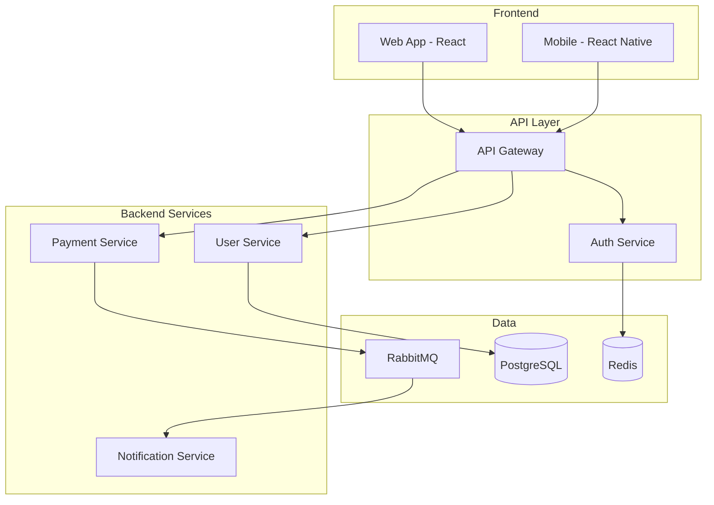

> Con subgraphs pueden agrupar componentes por capa, por dominio, o por equipo. Esto da una vista de alto nivel que cualquier persona del equipo puede entender en 30 segundos.

🔄 **[TRANSICIÓN]**

> Ya sabemos qué es Mermaid, qué tipos de diagramas soporta, y dónde usarlo. Ahora veamos cómo usarlo **bien** — las mejores prácticas.

---

### 📏 SLIDE 29 — best-practices (Mejores Prácticas)
**"Mejores Prácticas con Mermaid"**
**⏱️ Tiempo: 52:00 - 53:30 (1.5 min)**

---

**DIÁLOGO:**

> Después de usar Mermaid en varios proyectos, estas son las lecciones aprendidas:

> **1. Mantener diagramas pequeños y enfocados**
> - Un diagrama debe comunicar UNA idea
> - Si tiene más de 15-20 nodos, dividirlo en varios

> **2. Usar diagramas como documentación viva**
> - Actualizar en el mismo PR que el código
> - Incluir en la definición de "done" del equipo

> **3. Elegir el tipo correcto de diagrama**
> - Flujo → procesos y decisiones
> - Secuencia → comunicación entre componentes
> - ER → modelo de datos
> - Estado → ciclos de vida

> **4. Documentar el "por qué", no solo el "qué"**
> - Agregar notas y comentarios con `%%`
> - Complementar con texto explicativo alrededor del diagrama

⏸️ **[PAUSA INTERACTIVA]**

> **¿Cuál de estas prácticas les parece más difícil de implementar en su equipo?** Piénsenlo un momento.

---

### 🏷️ SLIDE 30 — best-practices-naming (Mejores Prácticas)
**"Convenciones de Nombrado"**
**⏱️ Tiempo: 53:30 - 54:30 (1 min)**

---

**DIÁLOGO:**

> Las convenciones de nombrado parecen triviales, pero hacen la diferencia entre diagramas mantenibles y diagramas que nadie entiende en 3 meses.

> **Recomendaciones:**

> - **IDs de nodos**: usar camelCase descriptivo (`apiGateway`, `userService`)
> - **Etiquetas**: usar lenguaje natural ("Servicio de Usuarios", "Base de Datos")
> - **Archivos**: nombrar consistentemente (`architecture-overview.md`, `auth-flow.md`)
> - **Comentarios**: usar `%%` para explicar decisiones no obvias

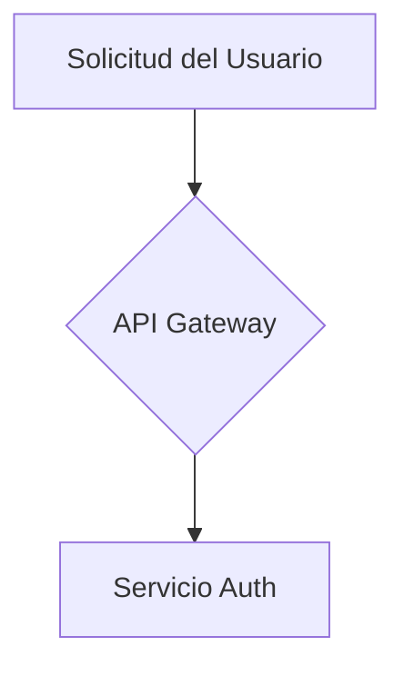

> El objetivo: que cualquier persona del equipo pueda leer y modificar el diagrama sin necesitar contexto adicional.

---

### 🔧 SLIDE 31 — best-practices-maintenance (Mejores Prácticas)
**"Mantenimiento y Gobernanza"**
**⏱️ Tiempo: 54:30 - 55:30 (1 min)**

---

**DIÁLOGO:**

> El mayor riesgo con cualquier documentación es que se desactualice. ¿Cómo evitarlo con Mermaid?

> **Estrategias de gobernanza:**

> 1. **Ownership claro**: cada diagrama tiene un equipo responsable
> 2. **Review obligatorio**: cambios en `/docs/architecture/` requieren aprobación del tech lead
> 3. **Fecha de revisión**: agregar comentarios con fecha de última actualización
> 4. **Validación en CI**: fallar el build si hay diagramas con sintaxis rota
> 5. **Auditoría periódica**: revisar diagramas trimestralmente

> La regla de oro: **si cambias el código, cambias el diagrama**. Hacerlo parte de la cultura del equipo.

🙋 **[PREGUNTA AL PÚBLICO]**

> **¿Tienen algún proceso de revisión de documentación técnica en su equipo?** Si no lo tienen, este es un buen punto de partida.

---

### 🔗 SLIDE 32 — integration-git (Mejores Prácticas)
**"Integración con Git y CI/CD"**
**⏱️ Tiempo: 55:30 - 56:30 (1 min)**

---

**DIÁLOGO:**

> Veamos cómo integrar Mermaid en su flujo de trabajo de Git de forma práctica:

> **En el repositorio:**
```
/docs
  /architecture
    system-overview.md      ← diagrama de alto nivel
    auth-flow.md            ← flujo de autenticación
    data-model.md           ← diagrama ER
  /adr
    001-microservices.md    ← con diagramas de contexto
```

> **En el PR template:**
> - [ ] ¿Este cambio afecta la arquitectura? → Actualizar diagrama correspondiente

> **En el CI pipeline:**
> - Lint de sintaxis Mermaid
> - Generación automática de imágenes para documentación estática
> - Alerta si archivos de arquitectura no se modifican junto con cambios estructurales

> La integración con Git es lo que hace a Mermaid superior a herramientas visuales para equipos de desarrollo.

---

### ⚡ SLIDE 33 — tips-performance (Mejores Prácticas)
**"Rendimiento y Limitaciones"**
**⏱️ Tiempo: 56:30 - 58:00 (1.5 min)**

---

**DIÁLOGO:**

> Seamos honestos sobre las limitaciones. Mermaid no es perfecto para todo:

> **Limitaciones conocidas:**
> - Diagramas con más de ~50 nodos se vuelven difíciles de leer
> - El control de posicionamiento es limitado (no puedes mover nodos manualmente)
> - Algunos tipos de diagramas son menos maduros que otros
> - El renderizado puede variar ligeramente entre plataformas

> **Tips de rendimiento:**
> - Dividir diagramas grandes en múltiples diagramas pequeños
> - Usar `subgraph` para agrupar y reducir complejidad visual
> - Preferir direcciones `LR` para flujos lineales, `TD` para jerarquías
> - Evitar cruces de líneas reorganizando el orden de las declaraciones

> **Cuándo NO usar Mermaid:**
> - Diagramas de red con posicionamiento específico
> - Wireframes o mockups de UI
> - Diagramas con más de 100 elementos
> - Cuando necesitas interactividad avanzada (zoom, click, drill-down)

> Para esos casos, complementen con Draw.io, Figma, o herramientas especializadas.

🔄 **[TRANSICIÓN]**

> Y con eso llegamos al cierre. Recapitulemos lo que aprendimos hoy.

**💡 Nota del presentador:** Ser honesto sobre las limitaciones genera credibilidad. La audiencia confía más en alguien que reconoce los límites de la herramienta.

---

### 🎯 SLIDE 34 — closing (Cierre)
**"Resumen y Recursos"**
**⏱️ Tiempo: 58:00 - 60:00 (2 min)**

---

**DIÁLOGO:**

> Recapitulemos. Hoy aprendimos que:

> ✅ **Mermaid** convierte texto en diagramas — es "Markdown para diagramas"
> ✅ Soporta **11+ tipos de diagramas** para casi cualquier necesidad
> ✅ Es **versionable**, vive en Git, se revisa en PRs
> ✅ Tiene **integración nativa** en GitHub, GitLab, Notion y más
> ✅ Se puede **generar con IA** para acelerar la documentación
> ✅ Con buenas prácticas, se convierte en **documentación viva**

> **Recursos para seguir aprendiendo:**
> - 📖 Documentación oficial: **mermaid.js.org**
> - 🖥️ Editor en línea: **mermaid.live**
> - 💻 Extensión VS Code: "Mermaid Preview"
> - 🤖 Prompt para IA: "Genera un diagrama Mermaid de tipo [X] para [Y]"

🙋 **[PREGUNTA AL PÚBLICO]**

> **¿Cuál es el primer diagrama que van a crear con Mermaid cuando vuelvan a su escritorio?**

> *(Tomar 2-3 respuestas)*

> ¡Excelente! Les reto a que esta semana creen al menos UN diagrama Mermaid en su repositorio. Empiecen con el README — un diagrama de arquitectura de alto nivel. Van a ver cómo el equipo lo agradece.

> **¡Gracias por su tiempo y atención!** ¿Preguntas finales?

⏸️ **[PAUSA INTERACTIVA — Q&A]**

> *(Abrir espacio para preguntas finales. Si no hay preguntas, cerrar con energía.)*

> Recuerden: **mermaid.live** para practicar, y no duden en contactarme si necesitan ayuda implementando Mermaid en su equipo.

> ¡Éxito diagramando! 🎉

**💡 Nota del presentador:** Terminar con energía y un call-to-action claro. El reto de "un diagrama esta semana" genera compromiso. Quedarse disponible para preguntas individuales después de la sesión.

---

## ✅ Checklist del Presentador

### Antes de la presentación
- [ ] Laptop cargada y con adaptador de video
- [ ] Navegador abierto con **mermaid.live** en una pestaña
- [ ] Editor de código abierto (VS Code con extensión Mermaid Preview)
- [ ] Presentación cargada y probada en el proyector
- [ ] Conexión a internet verificada (para demos en vivo)
- [ ] Plan B: capturas de pantalla de las demos por si falla internet
- [ ] Snippets de código listos para copiar/pegar durante el ejercicio
- [ ] Agua y reloj/timer visible

### Durante la presentación
- [ ] Hacer contacto visual con diferentes secciones de la audiencia
- [ ] Respetar los tiempos — usar timer discreto
- [ ] Si una demo falla, pasar al plan B sin disculparse excesivamente
- [ ] Caminar entre la audiencia durante el ejercicio práctico (Slide 20)
- [ ] Tomar nota de preguntas interesantes para el Q&A final
- [ ] Ajustar ritmo según la energía de la audiencia

### Después de la presentación
- [ ] Compartir link de la presentación con los asistentes
- [ ] Enviar recursos adicionales por email/Slack
- [ ] Recopilar feedback (formulario rápido de 3 preguntas)
- [ ] Dar seguimiento a preguntas que no se pudieron responder en vivo

---

## 💡 Tips para el Presentador

### Manejo del tiempo
- Si vas **adelantado**: expandir las demos en vivo, pedir más participación, profundizar en preguntas del público
- Si vas **atrasado**: reducir las demos de slides 14-17 (diagramas avanzados), mostrar solo el código sin escribirlo en vivo
- El **ejercicio práctico** (Slide 20) es el buffer principal — puede ser 3-5 minutos según el tiempo disponible

### Manejo de la audiencia
- **Audiencia técnica senior**: enfocarse en casos de uso, CI/CD, gobernanza. Menos tiempo en sintaxis básica
- **Audiencia junior**: más tiempo en demos, más ejemplos paso a paso, más tiempo en el ejercicio
- **Audiencia mixta**: seguir el guión tal cual — está balanceado para ambos perfiles

### Manejo de problemas técnicos
- **Se cae internet**: usar capturas de pantalla pre-preparadas. El editor de la presentación funciona offline
- **El proyector no muestra bien el código**: aumentar font size del editor a 20px+ antes de empezar
- **Nadie participa en las preguntas**: reformular como "levanten la mano los que..." (más fácil que responder verbalmente)
- **Alguien hace una pregunta muy avanzada**: "Excelente pregunta, la anoto para el Q&A final donde podemos profundizar"

### Frases de emergencia
- Si pierdes el hilo: *"Volvamos al punto principal aquí..."*
- Si una demo falla: *"La tecnología nos recuerda por qué necesitamos buenos diagramas de troubleshooting"* (humor)
- Si nadie responde: *"No se preocupen, no hay respuesta incorrecta. Déjenme reformular..."*
- Si vas muy rápido: *"Hagamos una pausa aquí. ¿Alguna duda hasta este punto?"*

### Energía y ritmo
- **Minutos 0-10**: Energía alta, establecer rapport, generar curiosidad
- **Minutos 10-25**: Ritmo constante, alternar entre explicación y demo
- **Minutos 25-32**: Mantener atención con diagramas visualmente interesantes
- **Minutos 32-40**: Pico de energía con el ejercicio práctico
- **Minutos 40-52**: Ritmo conversacional, casos de uso reales
- **Minutos 52-58**: Tono de cierre, consolidar aprendizajes
- **Minutos 58-60**: Energía alta para el cierre, call-to-action motivador

---

## 📊 Resumen de Interacciones

| Tipo | Cantidad | Slides |
|------|----------|--------|
| 🙋 Preguntas al público | 12 | 1, 3, 7, 8, 10, 12, 16, 18, 21, 24, 27, 31, 34 |
| 💻 Demos en vivo | 11 | 3, 7, 8, 9, 10, 11, 12, 16, 17, 18, 28 |
| ⏸️ Pausas interactivas | 5 | 4, 9, 14, 29, 34 |
| ✏️ Ejercicios | 1 | 20 |
| 🔄 Transiciones | 8 | 2, 5, 6, 13, 17, 19, 28, 33 |

---

*Documento generado para la presentación de 34 slides "Mermaid: Diagramación Inteligente"*
*Duración total: 60 minutos | Formato: Interactivo con demos en vivo*
