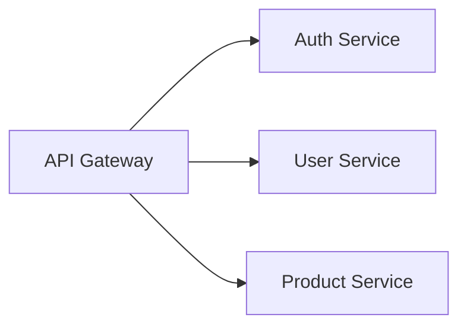

# 🎬 DIÁLOGO DE PRESENTACIÓN — Generación Automática de Documentación Técnica y Diagramas con Mermaid

## 📋 Información General

| Campo | Detalle |
|-------|---------|
| **Presentadores** | Daniel Felipe Melo y Angel Duran |
| **Duración Total** | 60 minutos |
| **Número de Slides** | 37 |
| **Formato** | Interactivo con demos en vivo |
| **Audiencia** | Desarrolladores, arquitectos, líderes técnicos |

---

## ⏱️ Distribución de Tiempo por Sección

| # | Sección | Slides | Tiempo | Presentador Principal |
|---|---------|--------|--------|----------------------|
| 1 | Documentación Automática | 1–3 | 6 min | Angel |
| 2 | Introducción a Mermaid | 4–5 | 3 min | Angel |
| 3 | Fundamentos | 6–9 | 7 min | Angel |
| 4 | Tipos de Diagramas | 10–16 | 10 min | Angel |
| 5 | Diagramas Avanzados | 17–20 | 7 min | Angel |
| 6 | Configuración y Temas | 21–22 | 4 min | Angel |
| 7 | Editor Interactivo | 23 | 5 min | Angel |
| 8 | Comparativa | 24–25 | 4 min | Daniel |
| 9 | Casos de Uso | 26–31 | 8 min | Daniel |
| 10 | Mejores Prácticas | 32–36 | 4 min | Daniel |
| 11 | Cierre | 37 | 2 min | Daniel + Angel |
| | **TOTAL** | **37** | **60 min** | |

---

## 🎭 Leyenda de Marcadores Interactivos

| Emoji | Significado |
|-------|-------------|
| 🙋 | **[PREGUNTA AL PÚBLICO]** — Momento de interacción con la audiencia |
| 💻 | **[DEMO EN VIVO]** — Demostración práctica en pantalla |
| ⏸️ | **[PAUSA INTERACTIVA]** — Momento para reflexión o discusión |
| ✏️ | **[EJERCICIO]** — Actividad práctica para los asistentes |
| 🔄 | **[TRANSICIÓN]** — Cambio de sección o tema |
| 💡 | **Nota del presentador** — Tips internos |

---

## 📖 GUIÓN COMPLETO

---

### 🟢 SECCIÓN 1: Documentación Automática (Slides 1–3) — 6 min

---

#### Slide 1 — cover (1.5 min) | 🎤 Angel

**Angel:** ¡Buenos días a todos! Bienvenidos a esta sesión sobre **Generación Automática de Documentación Técnica y Diagramas**. Mi nombre es Angel Duran y me acompaña Daniel Felipe Melo. Juntos vamos a mostrarles cómo la combinación de IA y herramientas como Mermaid puede transformar la forma en que documentamos nuestros proyectos.

#### Slide 2 — auto-doc-intro (2.5 min) | 🎤 Angel

¿Por qué Automatizar la Documentación?
La documentación manual se desactualiza rápidamente. La automatización garantiza que siempre refleje el estado real del sistema.

- 📉 **60% de la documentación técnica está desactualizada** — Eso significa que si abren la wiki de su proyecto ahora mismo, hay más de la mitad de probabilidad de que lo que lean ya no sea verdad. ¿Han tenido esa experiencia? Siguen un diagrama de arquitectura y resulta que ese servicio ya no existe.

- ⏰ **Los desarrolladores gastan un 20% de su tiempo documentando** — Eso es un día completo a la semana. En un equipo de 10 personas, son 2 desarrolladores completos dedicados solo a escribir y mantener documentación. Dos personas que podrían estar construyendo producto.

- 🤖 **Con IA, es 10x más rápido** — La IA generativa puede analizar código y generar diagramas en segundos. Lo que antes tomaba una hora de trabajo manual, ahora toma un prompt.

**Angel:** Pero no se trata solo de velocidad. Miren los otros puntos:

- 📝 **Herramientas como Mermaid** convierten texto en diagramas que se pueden versionar — no más archivos PNG desactualizados
- 🔄 **La documentación como código** con la integracion continua — si el diagrama tiene un error de sintaxis, el build falla. Si el código cambió pero el diagrama no, el pipeline te avisa.

**Angel:** En resumen: la documentación manual es una batalla perdida. La automatización no es un lujo — es la única forma de que la documentación se mantenga al día.

#### Slide 3 — auto-doc-workflow (2 min) | 🎤 Angel

**Angel:** Ok, ya sabemos que la documentación manual no funciona. Entonces, ¿cómo se ve un flujo automatizado? Veamos el siguiente flujo.

**Angel:** Imaginen esto como una cadena de producción donde cada eslabón se conecta con el siguiente:

- 1️⃣ **El desarrollador escribe código** — Hace lo que siempre hace: programar. No tiene que pensar en documentación.
- 2️⃣ **La IA analiza los cambios** — Un modelo de lenguaje (ChatGPT, Copilot, Claude) lee el código y genera o actualiza los diagramas Mermaid automáticamente. "Veo que agregaste un nuevo servicio, actualizo el diagrama de arquitectura."
- 3️⃣ **Los diagramas se renderizan en Markdown** — El código Mermaid se escribe en archivos `.md` y se renderiza visualmente en GitHub/GitLab sin hacer nada más.
- 4️⃣ **El CI valida todo** — Un pipeline de integracion continua verifica que la sintaxis Mermaid sea correcta y alerta si hay documentación desactualizada. "Este servicio cambió pero el diagrama no se actualizó."
- 5️⃣ **La documentación se publica** — Con cada release, la documentación sale actualizada automáticamente. Siempre refleja el estado real del sistema.

**Angel:** A la derecha de la diapositiva pueden ver este mismo flujo representado como diagrama Mermaid:

```
graph LR
    A[Código Fuente] --> B[IA Generativa]
    B --> C[Diagramas Mermaid]
    C --> D[Markdown + Git]
    D --> E[CI/CD Validación]
    E --> F[Documentación Publicada]
```

**Angel:** Noten la ironía: estamos usando Mermaid para explicar cómo funciona el flujo que usa Mermaid. Eso demuestra lo natural que es.

**Angel:** La clave de todo esto: la documentación **vive junto al código**.

🔄 **[TRANSICIÓN]**

**Angel:** Y la pieza central de este pipeline es **Mermaid**. Vamos a conocerlo a fondo.

---

### 🟢 SECCIÓN 2: Introducción a Mermaid (Slides 4–5) — 3 min

---

#### Slide 4 — intro (1.5 min) | 🎤 Angel

**Angel:** **Mermaid — Diagramación Inteligente**.

**Angel:** El concepto es este:

**📝 Texto → ⚙️ Mermaid → 📊 Diagrama**

**Angel:** ¿Qué significa esto en la práctica? Que en vez de abrir Visio, Draw.io o PowerPoint para crear un diagrama — arrastrando cajitas, alineando flechas, ajustando tamaños durante 30 minutos — ustedes simplemente **escriben texto**. Texto plano, como si escribieran un email. Y Mermaid lo convierte automáticamente en un diagrama profesional.

**Angel:** ¿Y por qué eso es revolucionario? Porque si el diagrama es texto:
- Se puede **guardar en Git** junto al código
- Se puede **revisar en un Pull Request** — "oye, cambiaste la arquitectura, ¿actualizaste el diagrama?"
- Se puede **generar con IA** — le pides a ChatGPT un diagrama y te lo da listo
- Se puede **automatizar** — un script genera diagramas desde tu código

**Angel:** Esa es la promesa de Mermaid: diagramas que se mantienen solos porque viven como código. Vamos a ver cómo funciona en detalle.

---

#### Slide 5 — table-of-contents (1.5 min) | 🎤 Angel

**Angel:** Este es nuestro índice. Vamos a cubrir 9 secciones:

1. **Fundamentos de Mermaid**
2. **Tipos de Diagramas**
3. **Diagramas Avanzados**
4. **Configuración y Temas**
5. **Editor Interactivo**
6. **Comparativa con Otras Herramientas**
7. **Casos de Uso**
8. **Mejores Prácticas**
9. **Cierre y Recursos**

#### Slide 6 — what-is-mermaid (2 min) | 🎤 Angel

**Angel:** Entremos en materia. ¿Qué es Mermaid exactamente?

**Angel:** En una frase: es una herramienta que convierte **texto plano en diagramas**. Es de código abierto, está escrita en JavaScript, y funciona directamente en el navegador — no necesitan instalar nada ni levantar un servidor.

**Angel:** Veamos los datos:

- 🗓️ **Creado en 2014** por Knut Sveidqvist, un desarrollador sueco que estaba frustrado con lo difícil que era mantener diagramas actualizados. Su idea fue: "si el código es texto y lo versionamos, ¿por qué los diagramas no pueden ser texto también?"

- 🌐 **Renderiza en el navegador** — No necesita servidor, no necesita Java (como PlantUML), no necesita nada instalado. Solo JavaScript. Por eso funciona en cualquier página web.

- 🏢 **Adoptado por las plataformas más grandes** — GitHub, GitLab, Notion, Obsidian, Confluence... Si escriben un bloque ` ```mermaid ` en un README de GitHub, se renderiza automáticamente. Sin plugins, sin configuración, sin exportar imágenes.

- ⭐ **Más de 70,000 estrellas en GitHub** — Para dar contexto, React tiene ~220k y Vue ~200k. 70k para una herramienta de diagramación es enorme. Significa comunidad activa, actualizaciones constantes, y que no va a desaparecer mañana.

#### Slide 7 — basic-syntax (2 min) | 🎤 Angel

**Angel:** Ahora veamos cómo se escribe un diagrama. La sintaxis de Mermaid es intencionalmente simple.

**Angel:** Todo diagrama tiene 3 ingredientes:

- 🏷️ **Tipo de diagrama** — La primera línea siempre declara qué tipo es: `graph` para flujos, `sequenceDiagram` para secuencias, `classDiagram` para clases. Es como el "DOCTYPE" de HTML — le dice a Mermaid qué esperar.

- 📦 **Nodos** — Son las cajitas. Se definen con un ID y una etiqueta: `A[Mi Nodo]`. El ID (`A`) es interno para las conexiones, la etiqueta (`Mi Nodo`) es lo que se muestra visualmente.

- ➡️ **Conexiones** — Son las flechas entre nodos. `-->` flecha normal, `---` línea sin punta, `-.->` línea punteada. También pueden agregar texto: `-->|mi texto|`

- 🎨 **Extras** — Subgrafos para agrupar, estilos para colorear, directivas para configurar.

💻 **[DEMO EN VIVO]**

**Angel:** Miren el ejemplo en la diapositiva — con solo 3 líneas:

```
graph LR
    A[Texto Plano] --> B[Parser Mermaid]
    B --> C[Diagrama SVG]
```

**Angel:** Desglosemos:
- `graph LR` — "Quiero un diagrama de flujo, de izquierda a derecha" (LR = Left to Right)
- `A[Texto Plano]` — Un nodo con ID `A` que muestra "Texto Plano"
- `-->` — Una flecha que conecta A con B
- `B[Parser Mermaid]` — Segundo nodo
- `B --> C[Diagrama SVG]` — B se conecta con C

**Angel:** Con esas 3 líneas describimos el flujo completo de Mermaid: escribes texto, el parser lo procesa, y obtienes un diagrama SVG. Si pueden escribir un JSON, pueden escribir Mermaid.


#### Slide 8 — advantages (1.5 min) | 🎤 Angel

**Angel:** Ahora la pregunta clave: ¿por qué elegir Mermaid sobre herramientas visuales como Visio, Lucidchart o Draw.io? Veamos las ventajas una por una:

- 🔀 **Versionable en Git** — Los diagramas son texto plano. Eso significa que pueden hacer `git diff` y ver exactamente qué cambió en un diagrama. Con Visio o Lucidchart eso es imposible — son archivos binarios o viven en la nube.

- 📄 **Integración nativa en Markdown** — Escriben un bloque ` ```mermaid ` en cualquier archivo `.md` y se renderiza automáticamente en GitHub, GitLab o Notion. No necesitan exportar imágenes ni mantener archivos PNG separados.

- 🤖 **Generación automatizada con IA** — Le dicen a ChatGPT o Copilot "hazme un diagrama de mi arquitectura" y les devuelve código Mermaid funcional. Esto es imposible con herramientas visuales.

- 🔓 **Sin dependencia de herramientas propietarias** — No necesitan licencia de Visio,  ni cuenta de Lucidchart, ni estar conectados a internet. Mermaid es open source y gratuito.

- ✅ **Renderizado consistente** — El mismo código genera el mismo diagrama en cualquier plataforma. No hay problemas de "se ve diferente en mi máquina".

**Angel:** En resumen: Mermaid trata los diagramas como código. El mismo principio de "Infrastructure as Code" pero aplicado a la documentación.

#### Slide 9 — rendering-architecture (1.5 min) | 🎤 Angel

**Angel:** Para los curiosos: ¿cómo hace Mermaid para convertir texto en un diagrama? Veamos el siguiente flujo. Es como una fábrica con 4 estaciones:

**Angel:** Imaginen que escriben `graph TD A --> B`. ¿Qué pasa internamente?

1. 🔤 **Lexer (Tokenizador)** — Es el primer paso. Lee el texto carácter por carácter y lo separa en "tokens" — piezas con significado. Como cuando leen una oración y separan las palabras. Identifica: "esto es una palabra clave `graph`", "esto es un nodo `A`", "esto es una flecha `-->`".

2. 🌳 **Parser JISON** — Toma esos tokens y construye un **AST** (Abstract Syntax Tree — Árbol de Sintaxis Abstracta). ¿Qué es eso? Piénsenlo como un organigrama del diagrama: "hay un diagrama de tipo graph, que tiene un nodo A conectado a un nodo B con una flecha". Es la misma técnica que usan los compiladores de Java o Python para entender código fuente.

3. 📐 **Motor dagre-d3 (Layout)** — Aquí viene la magia visual. Este motor toma el árbol y calcula: "¿dónde pongo cada cajita? ¿Cómo trazo las flechas para que no se crucen? ¿Cuánto espacio necesito?" Es un problema matemático de grafos que se resuelve automáticamente.

4. 🖼️ **Salida SVG** — Finalmente genera el diagrama como **SVG** (Scalable Vector Graphics). ¿Por qué SVG y no una imagen PNG? Porque SVG es un formato vectorial — se puede escalar a cualquier tamaño sin pixelarse, se puede personalizar con CSS (cambiar colores, fuentes), y los lectores de pantalla pueden leerlo para accesibilidad.

**Angel:** Todo esto ocurre en el navegador, en milisegundos. No necesitan un servidor. Por eso Mermaid funciona en GitHub, en Notion, en cualquier página web — solo necesita JavaScript.

🔄 **[TRANSICIÓN]**

**Angel:** Ahora que entendemos cómo funciona por dentro, vamos a ver todos los tipos de diagramas que Mermaid soporta.

---

### 🟢 SECCIÓN 4: Tipos de Diagramas (Slides 10–16) — 10 min

---

#### Slide 10 — flowchart (1.5 min) | 🎤 Angel

💻 **[DEMO EN VIVO]**

**Angel:** Empecemos con el tipo más utilizado: los **Diagramas de Flujo**. Son los que todos conocemos — cajitas conectadas con flechas que representan un proceso con decisiones. Pero en Mermaid, en vez de arrastrar cajitas, los escribimos.

**Angel:** Veamos el ejemplo en pantalla — un flujo de autenticación:

```
graph TD
    A([Inicio]) ==> B{¿Autenticado?}
    B -->|Sí| C[Dashboard]
    B -.->|No| D[[Validar Login]]
    subgraph Backend
    D --> E[(Base de Datos)]
    end
    E --> B
```

**Angel:** Leamos la historia:
1. El usuario llega al sistema (nodo **Inicio** — redondeado)
2. Se verifica: **¿está autenticado?** (diamante de decisión)
3. Si **sí** → va directo al Dashboard (rectángulo)
4. Si **no** → se ejecuta la subrutina **Validar Login** (doble corchete)
5. La validación consulta la **Base de Datos** (cilindro) — agrupada en un subgraph "Backend"
6. Después de validar, vuelve a verificar si está autenticado

**Angel:** Noten que cada forma tiene un significado visual diferente:

| Sintaxis | Forma | Significado |
|----------|-------|-------------|
| `([texto])` | Redondeado | Inicio o fin |
| `{texto}` | Diamante | Decisión |
| `[texto]` | Rectángulo | Acción |
| `[[texto]]` | Doble borde | Subrutina |
| `[(texto)]` | Cilindro | Base de datos |

**Angel:** Y las flechas también comunican:
- `==>` gruesa — flujo principal
- `-->` sólida — conexión normal
- `-.->` punteada — camino alternativo o de error

**Angel:** Con pocas líneas tenemos un flujo de autenticación completo. Cada forma comunica algo diferente sin necesidad de leyenda.


#### Slide 11 — sequence-diagram (1.5 min) | 🎤 Angel

**Angel:** Los **Diagramas de Secuencia** responden a la pregunta: "¿Qué pasa cuando un usuario hace X?" Muestran la conversación entre componentes paso a paso.

**Angel:** Veamos el ejemplo en pantalla — un usuario guardando datos:

```
sequenceDiagram
    participant U as Usuario
    participant F as Frontend
    participant A as API
    participant DB as BD
    U->>F: Clic Guardar
    F->>A: POST /api/datos
    A->>DB: INSERT
    DB-->>A: OK
    A-->>F: 201 Created
    F-->>U: Éxito
```

**Angel:** Leamos la historia de arriba a abajo:
1. El **Usuario** hace clic en "Guardar" en la interfaz
2. El **Frontend** envía un POST a la API con los datos
3. La **API** hace un INSERT en la base de datos
4. La **BD** responde "OK, se guardó"
5. La **API** responde al frontend con "201 Created"
6. El **Frontend** muestra "Éxito" al usuario

**Angel:** Ahora la sintaxis:
- `participant U as Usuario` — Define un actor. `U` es el ID corto, `Usuario` es lo que se muestra
- `->>` (flecha sólida) — Es un **request**, una llamada que va hacia adelante
- `-->>` (flecha punteada) — Es un **response**, la respuesta que vuelve
- El texto después de `:` describe qué se envía

**Angel:** ¿Por qué es tan útil? Porque con 10 líneas documentan toda la interacción entre 4 componentes. Si un nuevo developer necesita entender "¿qué pasa cuando el usuario guarda?", este diagrama lo explica en 5 segundos. Sin necesidad de leer código.

#### Slide 12 — class-diagram (1.5 min) | 🎤 Angel

**Angel:** Los **Diagramas de Clases** — Muestran las "piezas" de un sistema: qué clases existen, qué datos tienen, qué pueden hacer, y cómo se relacionan entre sí.

**Angel:** Veamos el ejemplo en pantalla. Es un modelo simple de animales:

```
classDiagram
    class Animal {
        +String nombre
        +int edad
        +hacerSonido() void
    }
    class Perro {
        +String raza
        +buscar() void
    }
    class Gato {
        +boolean esInterior
        +ronronear() void
    }
    Animal <|-- Perro
    Animal <|-- Gato
```

**Angel:** Desglosemos:

**Las clases** — Cada bloque `class NombreClase { }` define una clase con:
- **Atributos** (datos): `+String nombre` significa que tiene un campo público de tipo String llamado "nombre"
- **Métodos** (acciones): `+hacerSonido() void` significa que puede ejecutar la acción "hacerSonido"

**La visibilidad** — El símbolo antes del tipo indica quién puede acceder:
- `+` = **público** — cualquiera puede verlo
- `-` = **privado** — solo la propia clase
- `#` = **protegido** — la clase y sus hijos

**La herencia** — `Animal <|-- Perro` se lee: "Perro **hereda de** Animal". La flecha con triángulo apunta al padre. Esto significa que Perro tiene todo lo de Animal (nombre, edad, hacerSonido) MÁS sus propios atributos (raza) y métodos (buscar).

**Angel:** ¿Cuándo usarlo?
- Documentar el **modelo de dominio** de su aplicación
- Explicar **patrones de diseño** (Strategy, Factory, Observer...)
- Mostrar la **estructura de una librería** o SDK a otros desarrolladores
- Complementar la documentación de una **API** mostrando los objetos que maneja

---

#### Slide 13 — state-diagram (1.5 min) | 🎤 Angel

**Angel:** Los **Diagramas de Estado** responden a una pregunta clave: ¿en qué estados puede estar algo y cómo pasa de un estado a otro? Piensen en un pedido de Amazon: puede estar "Pendiente", "En preparación", "Enviado", "Entregado" o "Devuelto". Cada acción lo mueve de un estado al siguiente.

**Angel:** En este ejemplo modelamos el ciclo de vida de un documento — como un artículo de blog o una propuesta técnica:

```
stateDiagram-v2
    [*] --> Borrador
    Borrador --> EnRevision : Enviar
    EnRevision --> Aprobado : Aprobar
    EnRevision --> Rechazado : Rechazar
    Rechazado --> Borrador : Corregir
    Aprobado --> Publicado : Publicar
    Publicado --> [*]
```

**Angel:** Leamos el flujo como una historia:
1. El documento **nace** como Borrador (`[*] --> Borrador` — el asterisco es el punto de inicio)
2. El autor lo **envía** a revisión (`Borrador --> EnRevision : Enviar`)
3. El revisor tiene dos opciones: **aprobar** o **rechazar**
4. Si lo **rechazan**, vuelve a Borrador para corrección — noten que es un ciclo, puede ir y venir
5. Si lo **aprueban**, se puede **publicar**
6. Una vez publicado, el ciclo termina (`Publicado --> [*]` — el asterisco final)

**Angel:** La sintaxis es: `EstadoOrigen --> EstadoDestino : Acción`. El texto después de los dos puntos es la acción que dispara la transición.

**Angel:** ¿Dónde usarlo en su trabajo?
- **Tickets de Jira** — Documentar los estados válidos y transiciones permitidas
- **Pedidos en e-commerce** — Pendiente → Pagado → Enviado → Entregado
- **Workflows de aprobación** — PRs, documentos, presupuestos
- **Máquinas de estado en código** — Si tienen un state machine en su app, este diagrama lo documenta perfectamente

---

#### Slide 14 — gantt-diagram (1.5 min) | 🎤 Angel

**Angel:** Los **Diagramas de Gantt** — Son esas barras horizontales que muestran cuánto dura cada tarea y cuándo empieza. Los usan mucho los project managers en herramientas como Jira o MS Project. Bueno, Mermaid también los genera desde texto.

**Angel:** Veamos el ejemplo en pantalla — un plan de proyecto simplificado:

```
gantt
    title Plan de Proyecto
    dateFormat YYYY-MM-DD
    section Diseño
    Investigación :a1, 2024-01-01, 10d
    Prototipo :a2, after a1, 12d
    section Desarrollo
    Backend :b1, after a2, 15d
    Frontend :b2, after a2, 18d
```

**Angel:** Desglosemos la sintaxis:
- `title Plan de Proyecto` — El nombre que aparece arriba del diagrama
- `dateFormat YYYY-MM-DD` — Le dice a Mermaid cómo interpretar las fechas
- `section Diseño` — Agrupa tareas visualmente por fase
- `Investigación :a1, 2024-01-01, 10d` — Una tarea con ID `a1`, que empieza el 1 de enero y dura 10 días
- `Prototipo :a2, after a1, 12d` — Aquí está lo poderoso: `after a1` significa que el Prototipo **no puede empezar** hasta que termine la Investigación. Es una dependencia.

**Angel:** Noten que Backend y Frontend ambos dicen `after a2` — eso significa que arrancan **en paralelo** una vez que el Prototipo termina. Mermaid los dibuja lado a lado automáticamente.

**Angel:** ¿Cuándo usarlo?
- **Propuestas técnicas (RFC)** — Mostrar el timeline estimado de implementación
- **Planificación de sprints** — Visualizar qué va en paralelo y qué depende de qué
- **Reportes a stakeholders** — "Así va el proyecto" en un vistazo

**Angel:** No reemplaza Jira ni MS Project para gestión diaria.

#### Slide 15 — er-diagram (1 min) | 🎤 Angel

**Angel:** Los **Diagramas Entidad-Relación** — o diagramas ER — son fundamentales para cualquiera que trabaje con bases de datos. Modelan las tablas, sus columnas y cómo se relacionan entre sí.

**Angel:** Veamos el ejemplo en pantalla. Imaginen un e-commerce simple:

```
erDiagram
    USUARIO ||--o{ PEDIDO : realiza
    PEDIDO ||--|{ LINEA_PEDIDO : contiene
    PRODUCTO ||--o{ LINEA_PEDIDO : incluido_en
    USUARIO {
        int id PK
        string nombre
        string email
    }
    PEDIDO {
        int id PK
        date fecha
        float total
    }
```

**Angel:** ¿Cómo se lee? Tenemos 4 entidades (tablas):
- **USUARIO** — con id, nombre y email
- **PEDIDO** — con id, fecha y total
- **LINEA_PEDIDO** — la tabla intermedia que conecta pedidos con productos
- **PRODUCTO** — (definido en la relación aunque no mostramos sus atributos aquí)

**Angel:** Las líneas entre entidades indican la **cardinalidad** — cuántos registros de un lado se relacionan con el otro:
- `||` = exactamente **uno** (un pedido pertenece a UN usuario)
- `o{` = **cero o muchos** (un usuario puede tener 0, 1, o muchos pedidos)
- `|{` = **uno o muchos** (un pedido tiene al menos 1 línea)

**Angel:** Entonces se lee así: "Un USUARIO **realiza** cero o muchos PEDIDOS. Un PEDIDO **contiene** una o muchas LINEAS. Un PRODUCTO está **incluido en** cero o muchas LINEAS."

**Angel:** El `PK` marca la clave primaria. También pueden usar `FK` para claves foráneas y `UK` para claves únicas.

**Angel:** ¿El beneficio? Documentan su esquema de base de datos directamente en el repositorio. Cada vez que hacen una migración, actualizan el diagrama en el mismo PR. Nunca más un diagrama ER desactualizado en Confluence.

---

#### Slide 16 — pie-chart (1 min) | 🎤 Angel

**Angel:** El último tipo básico: los **Diagramas de Pastel**. Son los más simples de todos — perfectos cuando necesitan mostrar "¿cómo se distribuye algo?" de un vistazo.

**Angel:** Veamos el ejemplo en pantalla:

```
pie title Lenguajes más usados 2024
    "JavaScript" : 30
    "Python" : 25
    "TypeScript" : 18
    "Java" : 12
    "C#" : 8
    "Otros" : 7
```

**Angel:** La sintaxis es literalmente: `"etiqueta" : valor`. Eso es todo. Mermaid calcula los porcentajes y genera el gráfico automáticamente. No necesitan sumar 100 — Mermaid lo normaliza.

**Angel:** ¿Qué nos dice este diagrama? Que JavaScript sigue dominando con 30%, Python le pisa los talones con 25%, y TypeScript crece fuerte con 18%. Java y C# quedan más atrás.

**Angel:** ¿Cuándo usarlo?
- En un **README** para mostrar la distribución de tecnologías del proyecto
- En **reportes** para visualizar métricas (bugs por severidad, tickets por equipo)
- En **presentaciones** para datos simples que no necesitan un dashboard completo

**Angel:** No va a reemplazar Chart.js ni Grafana, pero para una visualización rápida en documentación Markdown, es imbatible por su simplicidad.

🔄 **[TRANSICIÓN]**

**Angel:** Esos son los 7 tipos básicos. Ahora vamos con los diagramas avanzados que Mermaid ha agregado recientemente.

### 🟢 SECCIÓN 5: Diagramas Avanzados (Slides 17–20) — 7 min

---

#### Slide 17 — mindmap-diagram (2 min) | 🎤 Angel

**Angel:** Entramos en los **Diagramas Avanzados**. El primero: **Mapas Mentales**.

**Angel:** Veamos el ejemplo en pantalla:

```
mindmap
  root((Mermaid))
    Diagramas
      Flujo
      Secuencia
      Clases
    Ventajas
      Texto plano
      Versionable
      Open Source
    Integraciones
      GitHub
      GitLab
      Notion
```

**Angel:** ¿Cómo funciona?
- `root((Mermaid))` — El doble paréntesis crea un **nodo circular** en el centro. Es el concepto principal.
- La **indentación** define la jerarquía — como un outline de texto. Cada nivel más adentro es un hijo del anterior.
- No necesitan flechas ni conexiones — la estructura se define solo con espacios.

**Angel:** En este ejemplo, "Mermaid" es el centro y tiene 3 ramas:
- **Diagramas** — con sus tipos: Flujo, Secuencia, Clases
- **Ventajas** — lo que lo hace especial: Texto plano, Versionable, Open Source
- **Integraciones** — dónde funciona: GitHub, GitLab, Notion

**Angel:** ¿Dónde usarlo?
- Documentar la **arquitectura de alto nivel** de un sistema (servicios, dependencias, equipos)
- **Planificar features** — desglosar una épica en historias
- **Brainstorming** en equipo — capturar ideas rápidamente
- **Onboarding** — mostrar el "mapa" completo del proyecto a alguien nuevo


#### Slide 18 — timeline-diagram (1.5 min) | 🎤 Angel

**Angel:** Las **Líneas de Tiempo** son perfectas para contar una historia cronológica. ¿Alguna vez han necesitado explicar cómo evolucionó un proyecto? ¿O mostrar un roadmap a stakeholders? Con Mermaid lo hacen en segundos.

**Angel:** Veamos el ejemplo en pantalla — la propia historia de Mermaid:

```
timeline
    title Historia de Mermaid
    2014 : Creación por Knut Sveidqvist
    2019 : Adopción masiva en GitHub
    2021 : Soporte nativo en GitHub Markdown
    2022 : Integración en Notion
    2023 : Boom con IA generativa
    2024 : Más de 70k estrellas
```

**Angel:** La sintaxis no puede ser más simple: `año : evento`. Eso es todo. Y miren la historia que cuenta:

- **2014** — Un desarrollador sueco crea Mermaid como proyecto personal
- **2019** — La comunidad lo descubre y empieza a crecer
- **2021** — GitHub lo integra nativamente — ya no necesitas plugins
- **2022** — Notion se suma al soporte
- **2023** — Con el boom de ChatGPT y la IA generativa, Mermaid explota porque los LLMs pueden generarlo fácilmente
- **2024** — Supera las 70,000 estrellas en GitHub

**Angel:** ¿Dónde pueden usar esto en su trabajo?
- **Roadmaps de producto** — Mostrar qué viene en cada trimestre
- **Historiales de incidentes** — Documentar qué pasó y cuándo
- **Evolución de arquitectura** — Cómo el sistema cambió con el tiempo
- **Onboarding** — Dar contexto histórico a nuevos miembros del equipo

#### Slide 19 — gitgraph-diagram (2 min) | 🎤 Angel

**Angel:** los **Diagramas Git**. seguro usan alguna estrategia de branching — Git Flow. Pero ¿cómo la documentan? ¿Cómo le explican a un nuevo miembro del equipo cuál es el flujo de ramas?

**Angel:** Con GitGraph, lo visualizan directamente en código:

```
gitGraph
    commit
    commit
    branch develop
    checkout develop
    commit
    commit
    branch feature
    checkout feature
    commit
    checkout develop
    merge feature
    checkout main
    merge develop
    commit tag:"v1.0"
```

**Angel:** Leamos el flujo paso a paso:
1. Empezamos en `main` con 2 commits iniciales (el proyecto ya existe)
2. Creamos la rama `develop` — aquí se integra el trabajo del equipo
3. Hacemos 2 commits en develop (trabajo en progreso)
4. Creamos una rama `feature` desde develop — aquí un dev trabaja en una funcionalidad específica
5. Hacemos 1 commit en feature (la funcionalidad)
6. Mergeamos `feature` de vuelta a `develop` — la funcionalidad está lista
7. Mergeamos `develop` a `main` — todo listo para producción
8. Taggeamos `v1.0` — release oficial

**Angel:** Esto es exactamente un flujo **Git Flow** simplificado. 

#### Slide 20 — quadrant-diagram (1.5 min) | 🎤 Angel

**Angel:** Ahora algo muy práctico: los **Diagramas de Cuadrante**. Clasifican elementos en dos dimensiones. Útiles para matrices de priorización y decisión. Mermaid permite crear ese tipo de matrices con código.

**Angel:** Veamos el ejemplo en pantalla — una priorización de features:

```
quadrantChart
    title Priorización de Features
    x-axis Bajo Esfuerzo --> Alto Esfuerzo
    y-axis Bajo Impacto --> Alto Impacto
    quadrant-1 Hacer primero
    quadrant-2 Planificar
    quadrant-3 Delegar
    quadrant-4 Eliminar
    Login social: [0.2, 0.8]
    Dark mode: [0.3, 0.4]
    Refactor DB: [0.8, 0.9]
    Animaciones: [0.7, 0.2]
```

**Angel:** ¿Cómo se lee esto? Imaginen que su equipo tiene 4 funcionalidades pendientes en el backlog:

- **Login social** — Agregar inicio de sesión con Google/Facebook
- **Dark mode** — Implementar modo oscuro en la app
- **Refactor DB** — Reestructurar la base de datos completa
- **Animaciones** — Agregar transiciones visuales a la interfaz

Los **ejes** evalúan cada feature en dos dimensiones: cuánto esfuerzo cuesta implementarla (horizontal) y cuánto impacto genera para el negocio (vertical). Los **4 cuadrantes** indican qué hacer según dónde caiga cada feature. Cada item se posiciona con coordenadas `[x, y]` de 0 a 1.

**Angel:** Veamos los resultados:
- 🟢 **"Login social" [0.2, 0.8]** — Poco esfuerzo, mucho impacto → ¡Hacer primero!: fácil de implementar y los usuarios lo piden mucho.
- 🟡 **"Refactor DB" [0.8, 0.9]** — Mucho esfuerzo, mucho impacto → Planificar. Vale la pena pero necesita semanas de trabajo, hay que agendarlo.
- 🔴 **"Animaciones" [0.7, 0.2]** — Mucho esfuerzo, poco impacto → Eliminar. Se ve bonito pero no mueve la aguja del negocio.
- ⚪ **"Dark mode" [0.3, 0.4]** — Poco esfuerzo, poco impacto → Delegar. se puede hacer si sobra tiempo o asignarlo.

**Angel:** Esto es perfecto para sesiones de planning con el equipo. En vez de discutir 30 minutos sobre qué priorizar, ponen todo en un cuadrante y la decisión se vuelve visual.

🔄 **[TRANSICIÓN]**

**Angel:** Ya conocemos todos los tipos de diagramas. Ahora veamos cómo personalizarlos.


#### Slide 21 — themes-config (2 min) | 🎤 Angel

**Angel:** Una de las cosas más útiles de Mermaid es que no se limita a un solo estilo visual. Incluye **temas predefinidos** y permite personalización completa.

**Angel:** ¿Qué es un tema en Mermaid? Es un conjunto de colores, fuentes y estilos que se aplican a todo el diagrama de golpe. Miren las tarjetas de colores en la parte inferior de la diapositiva:

- 🎭 **default** — El estándar, con colores neutros grises
- 🌙 **dark** — Para fondos oscuros, como el que usamos en esta presentación
- 🌲 **forest** — Tonos verdes naturales, ideal para presentaciones ecológicas
- ⚪ **neutral** — Minimalista en blanco/gris, perfecto para documentación formal e impresión
- 🔧 **base** — Sin estilos propios, es el punto de partida para personalización total

**Angel:** ¿Cómo se cambia el tema? Muy simple, agregan esta línea al inicio del diagrama:

```
%%{init: {theme: "dark"}}%%
```

**Angel:** Y si necesitan algo más específico:
- 🖌️ **Variables CSS** les permiten cambiar colores individuales, fuentes y bordes
- 🔧 **themeVariables** da control granular sobre cada elemento del diagrama
- 💻 **mermaid.initialize()** en JavaScript configura el tema de forma global para toda la página

**Angel:** Esto es clave para equipos que quieren que sus diagramas sigan la identidad visual de la empresa. Definen un tema una vez y lo reutilizan en todos los repositorios.

#### Slide 22 — directives-config (2 min) | 🎤 Angel

**Angel:** Ahora vamos un paso más allá. Las **directivas** permiten controlar el comportamiento del renderizado directamente desde el código del diagrama. Piénsenlo como "configuración inline" — no necesitan tocar JavaScript, todo va dentro del propio diagrama.

**Angel:** ¿Qué pueden configurar?

- 🔒 **securityLevel** — Controla qué tan estricto es Mermaid con el HTML. En `strict` no permite nada, en `loose` permite links y tooltips. Importante para seguridad en producción.
- 〰️ **flowchart: { curve: "basis" }** — Cambia las flechas rectas por curvas suaves. Hace los diagramas más elegantes.
- 👥 **sequence: { mirrorActors: false }** — En diagramas de secuencia, evita que los actores se repitan abajo.
- 🔤 **fontSize, fontFamily** — Controlan la tipografía de todo el diagrama.
- 📝 **Directivas inline** — Se escriben con `%%{init: {...}}%%` al inicio del diagrama.
- 🎨 **classDef y style** — Permiten colorear nodos individuales.

**Angel:** Y hablando de colores, miren el diagrama en pantalla:

```
graph LR
    A[Normal]:::blue --> B[Alerta]:::red
    B --> C[OK]:::green
    classDef blue fill:#264653,stroke:#2a9d8f,color:#fff
    classDef red fill:#e76f51,stroke:#f4a261,color:#fff
    classDef green fill:#2a9d8f,stroke:#264653,color:#fff
```

**Angel:** Aquí definimos 3 clases de color — `blue`, `red`, `green` — y las aplicamos a cada nodo con `:::`. El nodo "Normal" es azul oscuro, "Alerta" es rojo/naranja, y "OK" es verde. Esto es muy útil para:
- Resaltar estados críticos en un flujo (error en rojo, éxito en verde)
- Diferenciar servicios por equipo o dominio
- Seguir la paleta de colores corporativa


### 🟢 SECCIÓN 7: Editor Interactivo (Slide 23) — 5 min

---

#### Slide 23 — editor-playground (5 min) | 🎤 Angel

✏️ **[EJERCICIO]**

**Angel:** El diagrama inicial combina todo lo que vimos en los slides anteriores:

```
graph TD
    A([Inicio]) ==> B{¿Tipo de diagrama?}
    B -->|Flujo| C[graph TD/LR]
    B -.->|Secuencia| D[sequenceDiagram]
    B -->|Clases| E[classDiagram]
    subgraph Resultado
    C --> F[(Documentación)]
    D --> F
    E --> F
    end
    F -->|Comparte| G([Fin])
```

**Angel:** Noten que usa todo lo que vimos en las diapositivas anteriores:
- `([Inicio])` y `([Fin])` — nodos redondeados
- `{¿Tipo?}` — diamante de decisión
- `==>` flecha gruesa, `-->` sólida, `-.->` punteada
- `[(Documentación)]` — cilindro (base de datos)
- `subgraph` para agrupar nodos

💻 **[DEMO EN VIVO]**

**Angel:** Ahora les muestro cómo lo modifico en vivo para crear algo diferente. Voy a convertirlo en un flujo de integracion continua:

```
graph TD
    A([Push a Git]) ==> B[Build]
    B --> C{¿Tests pasan?}
    C -->|Sí| D[[Deploy Staging]]:::highlight
    C -.->|No| E[Notificar equipo]
    E --> A
    subgraph Producción
    D --> F{¿QA OK?}
    F -->|Sí| G[(Deploy Prod)]
    F -.->|No| H[Rollback]
    end
    G --> I([Listo 🚀])
    classDef highlight fill:#2563eb,stroke:#1d4ed8,color:#fff
```

**Angel:** ¿Ven? Cambié el contexto pero usé las mismas herramientas: redondeados para inicio/fin, diamantes para decisiones, cilindro para el deploy a producción, subgraph para agrupar, y flechas punteadas para los caminos de error.

⏸️ **[PAUSA INTERACTIVA]**

**Angel:** Ahora les comparto un ejercicio para que lo hagan durante la sesión. Modifíquenlo y peguen su resultado en el chat.

🔄 **[TRANSICIÓN]**

**Angel:** Ahora le paso la palabra a Daniel para que nos hable de cómo se compara Mermaid con las alternativas.

---

### 🟢 SECCIÓN 8: Comparativa (Slides 24–25) — 4 min

---

#### Slide 24 — comparison (2 min) | 🎤 Daniel

**Daniel:** ¿Cómo se compara Mermaid con otras herramientas? Veamos las 6 principales:

| Herramienta | Tipo | Costo | Git-friendly |
|-------------|------|-------|--------------|
| **Mermaid** | Texto → Diagrama | Gratis | ✅ Sí |
| **PlantUML** | Texto → Diagrama | Gratis | ✅ Sí |
| **Draw.io** | Visual (drag & drop) | Gratis | ⚠️ XML |
| **Lucidchart** | Visual (SaaS) | Pago | ❌ No |
| **Visio** | Visual (desktop) | Pago | ❌ No |
| **D2** | Texto → Diagrama | Gratis | ✅ Sí |

**Daniel:** Las herramientas basadas en texto (Mermaid, PlantUML, D2) son las únicas que se integran naturalmente con Git y CI/CD.

---

#### Slide 25 — comparison-table (2 min) | 🎤 Daniel

**Daniel:** Profundicemos en la comparación:

**Mermaid gana en:**
- Soporte nativo en GitHub/GitLab (sin plugins)
- Curva de aprendizaje más baja
- Ecosistema JavaScript (fácil de integrar en web)
- Comunidad más grande y activa

**PlantUML gana en:**
- Más tipos de diagramas UML
- Más opciones de personalización
- Mejor para diagramas muy complejos

**D2 gana en:**
- Sintaxis más moderna
- Mejor layout engine
- Soporte para diagramas interactivos

**Daniel:** Nuestra recomendación: Mermaid para el 80% de los casos. PlantUML si necesitan UML estricto. D2 si buscan lo más moderno.

🙋 **[PREGUNTA AL PÚBLICO]**

**Daniel:** ¿Alguien ha usado PlantUML o D2? ¿Qué opinan comparado con lo que han visto de Mermaid?

---

### 🟢 SECCIÓN 9: Casos de Uso (Slides 26–31) — 8 min

---

#### Slide 26 — use-case-docs (1.5 min) | 🎤 Angel

**Angel:** Caso de uso #1: **Documentación Técnica y README**

El uso más directo: incluir diagramas en sus archivos Markdown. En GitHub, solo necesitan:

````markdown

````

**Angel:** Se renderiza automáticamente. No hay que generar imágenes, no hay que mantener archivos PNG desactualizados. El diagrama ES el código.

---

#### Slide 27 — use-case-ai (1.5 min) | 🎤 Angel

**Angel:** Caso de uso #2: **Generación con Inteligencia Artificial**

Aquí es donde todo se conecta con el tema principal de la presentación. Pueden pedirle a cualquier LLM:

> "Analiza este código y genera un diagrama de secuencia Mermaid que muestre el flujo de autenticación"

Y la IA genera el código Mermaid listo para usar. Herramientas como:
- **GitHub Copilot** — Genera diagramas inline
- **ChatGPT / Claude** — Análisis de código → diagramas
- **Scripts personalizados** — Integración con APIs de IA

**Angel:** La IA entiende Mermaid perfectamente porque es texto estructurado. Es mucho más fácil para un LLM generar texto Mermaid que generar una imagen.

---

#### Slide 28 — use-case-platforms (1 min) | 🎤 Angel

**Angel:** Caso de uso #3: **Plataformas Colaborativas**

Mermaid está soportado nativamente en:
- **GitHub** — README, Issues, PRs, Wikis
- **GitLab** — Markdown en todo el sistema
- **Notion** — Bloques de código Mermaid
- **Confluence** — Con plugin oficial
- **Obsidian** — Notas con diagramas
- **VS Code** — Preview en tiempo real

**Angel:** Donde sea que su equipo colabore, Mermaid probablemente ya está disponible.

---

#### Slide 29 — use-case-cicd (1.5 min) | 🎤 Angel

💻 **[DEMO EN VIVO]**

**Angel:** Caso de uso #4: **CI/CD y Arquitectura de Despliegue**

Pueden automatizar la generación de diagramas en su pipeline:

```yaml
# .github/workflows/docs.yml
- name: Generate Architecture Diagram
  run: |
    npx @mermaid-js/mermaid-cli mmdc \
      -i docs/architecture.mmd \
      -o docs/architecture.svg
```

**Angel:** Cada vez que el código cambia, el diagrama se regenera. Documentación que nunca se desactualiza.

---

#### Slide 30 — use-case-onboarding (1 min) | 🎤 Daniel

**Daniel:** Caso de uso #5: **Onboarding de Desarrolladores**

¿Cuánto tiempo tarda un nuevo desarrollador en entender su sistema? Con diagramas Mermaid actualizados en el repo:

- **Día 1:** Lee el README con diagrama de arquitectura general
- **Día 2:** Explora diagramas de secuencia de los flujos principales
- **Día 3:** Revisa diagramas de clases del dominio

**Daniel:** En lugar de semanas descifrando código, días entendiendo el sistema visualmente.

---

#### Slide 31 — use-case-architecture (1.5 min) | 🎤 Daniel

**Daniel:** Caso de uso #6: **Documentación de Arquitectura**

Este diagrama muestra una arquitectura de microservicios completa documentada con Mermaid. Incluye:
- API Gateway
- Servicios internos
- Bases de datos
- Colas de mensajes
- Servicios externos

**Daniel:** Todo en un archivo de texto que cualquier desarrollador puede actualizar en un PR. No necesitan acceso a Confluence ni permisos especiales.

🔄 **[TRANSICIÓN]**

**Daniel:** Ya saben qué es Mermaid, cómo usarlo, y dónde aplicarlo. Ahora las mejores prácticas para hacerlo profesionalmente.

---

### 🟢 SECCIÓN 10: Mejores Prácticas (Slides 32–36) — 4 min

---

#### Slide 32 — best-practices (1 min) | 🎤 Daniel

**Daniel:** Reglas de oro para diagramas Mermaid profesionales:

1. **Un diagrama, un propósito** — No intenten meter todo en un solo diagrama
2. **Máximo 15-20 nodos** — Si tiene más, divídanlo
3. **Nombres descriptivos** — `authService` no `A`
4. **Comentarios** — Usen `%%` para explicar decisiones
5. **Consistencia** — Misma dirección y estilo en todo el proyecto

---

#### Slide 33 — best-practices-naming (1 min) | 🎤 Daniel

**Daniel:** Convenciones de nombrado que recomendamos:

```
%% ✅ Bueno
graph LR
    apiGateway[API Gateway] --> authService[Auth Service]
    authService --> userDB[(User Database)]

%% ❌ Malo
graph LR
    A[API] --> B[Auth]
    B --> C[DB]
```

**Daniel:** Los IDs descriptivos hacen que el código sea legible sin necesidad de ver el diagrama renderizado. Esto es crucial cuando la IA genera o modifica diagramas.

---

#### Slide 34 — best-practices-maintenance (0.5 min) | 🎤 Daniel

**Daniel:** Para mantenimiento y gobernanza:

- Definan un **owner** por diagrama (como CODEOWNERS)
- Revisen diagramas en **code review** como cualquier código
- Establezcan una **cadencia de revisión** (ej: cada sprint)
- Usen **linters** para validar sintaxis Mermaid en CI

---

#### Slide 35 — integration-git (1 min) | 🎤 Daniel

**Daniel:** Integración con Git y CI/CD:

- **Pre-commit hooks** — Validar sintaxis antes de commit
- **GitHub Actions** — Renderizar y publicar automáticamente
- **PR previews** — Mostrar diagramas renderizados en PRs
- **Mermaid CLI** (`mmdc`) — Para renderizado en pipelines

```bash
# Validar todos los archivos .mmd
npx @mermaid-js/mermaid-cli mmdc -i diagram.mmd -o output.svg
```

---

#### Slide 36 — tips-performance (0.5 min) | 🎤 Daniel

**Daniel:** Limitaciones a tener en cuenta:

- **Rendimiento** — Diagramas con +50 nodos pueden ser lentos
- **Layout** — No siempre el auto-layout es perfecto
- **Personalización** — Menos flexible que herramientas visuales
- **Curva** — Diagramas muy complejos requieren práctica

**Daniel:** La solución: dividir diagramas grandes en múltiples diagramas pequeños y enfocados.

🔄 **[TRANSICIÓN]**

**Angel:** ¡Y llegamos al final! Vamos a cerrar con un resumen y recursos.

---

### 🟢 SECCIÓN 11: Cierre (Slide 37) — 2 min

---

#### Slide 37 — closing (2 min) | 🎤 Daniel + Angel

**Daniel:** Hagamos un resumen rápido de lo que cubrimos hoy:

✅ La documentación automática es posible y necesaria
✅ Mermaid es la herramienta ideal: texto → diagramas → Git
✅ Soporta +10 tipos de diagramas para cualquier necesidad
✅ Se integra con GitHub, GitLab, CI/CD, y herramientas de IA
✅ Con buenas prácticas, la documentación se mantiene sola

**Angel:** Recursos para seguir aprendiendo:

📚 **Documentación oficial:** [mermaid.js.org](https://mermaid.js.org)
🎮 **Editor en línea:** [mermaid.live](https://mermaid.live)
💻 **CLI:** `npm install @mermaid-js/mermaid-cli`
📖 **GitHub:** [github.com/mermaid-js/mermaid](https://github.com/mermaid-js/mermaid)

🙋 **[PREGUNTA AL PÚBLICO]**

**Angel:** ¿Preguntas? ¿Algo que quieran profundizar? Estamos aquí para ayudarles a implementar esto en sus equipos.

*[Espacio para 2-3 preguntas finales]*

**Daniel:** ¡Gracias a todos por su tiempo y participación! Si quieren seguir la conversación, nos encuentran en los canales del equipo.

**Angel:** ¡Éxito implementando Mermaid en sus proyectos! Recuerden: la mejor documentación es la que se genera sola. 🚀

---

## ✅ CHECKLIST DEL PRESENTADOR

### Antes de la Presentación

- [ ] Verificar que la presentación carga correctamente en el navegador
- [ ] Probar el editor interactivo (Slide 23)
- [ ] Tener [mermaid.live](https://mermaid.live) abierto como respaldo
- [ ] Verificar conexión a internet (para demos)
- [ ] Preparar diagrama de respaldo para el ejercicio
- [ ] Tener agua disponible
- [ ] Verificar micrófono y proyector
- [ ] Acordar señales entre Daniel y Angel para transiciones
- [ ] Tener timer visible (teléfono o reloj)
- [ ] Cargar la presentación en modo pantalla completa

### Durante la Presentación

- [ ] Mantener contacto visual con la audiencia
- [ ] Respetar los tiempos por sección
- [ ] Si una demo falla, pasar al siguiente punto sin detenerse
- [ ] Alternar entre presentadores según el guión
- [ ] Fomentar participación en los momentos marcados con 🙋
- [ ] Si hay preguntas fuera de tema, anotar y responder al final

### Después de la Presentación

- [ ] Compartir link de la presentación con los asistentes
- [ ] Enviar recursos adicionales por correo/chat
- [ ] Recopilar feedback
- [ ] Documentar preguntas que surgieron para futuras sesiones

---

## 💡 TIPS PARA LOS PRESENTADORES

### Para Angel

- Eres el presentador principal en las secciones 1-7 (Documentación Automática, Intro, Fundamentos, Tipos de Diagramas, Avanzados, Configuración, Editor)
- Tu fortaleza: explicaciones claras, demos en vivo y conexión con la audiencia
- Tip: Si el código no funciona en la demo, ten un screenshot preparado
- Mantén el ritmo en la sección de tipos de diagramas — es fácil extenderse

### Para Daniel

- Eres el presentador principal en las secciones 8-11 (Comparativa, Casos de Uso, Mejores Prácticas, Cierre)
- Tu fortaleza: dar contexto práctico y conectar con casos reales del equipo
- Tip: Usa ejemplos reales del equipo cuando sea posible
- En las preguntas al público, si nadie responde, ten una anécdota lista

### Manejo del Tiempo

| Señal | Acción |
|-------|--------|
| ⏰ -5 min en sección | Empezar a cerrar el punto actual |
| ⏰ -10 min total | Saltar directamente al cierre si es necesario |
| ⏰ Pregunta larga | "Excelente pregunta, la anotamos para el final" |
| ⏰ Demo falla | "Les muestro el resultado esperado" (screenshot) |

### Manejo de Situaciones

| Situación | Respuesta |
|-----------|-----------|
| Nadie participa | Hacer la pregunta más específica o contar una anécdota |
| Demasiadas preguntas | "Anotamos las preguntas y las respondemos al final" |
| Problema técnico | Angel toma la palabra mientras Daniel resuelve (o viceversa) |
| Se acaba el tiempo | Saltar a Slide 37 (cierre) y compartir recursos |
| Audiencia avanzada | Profundizar en configuración y CI/CD |
| Audiencia principiante | Más tiempo en fundamentos y ejercicio práctico |

### Frases Útiles para Transiciones

- "Ahora que entendemos X, veamos cómo se aplica en Y..."
- "Angel, ¿quieres tomar esta parte?"
- "Esto conecta directamente con lo que vimos antes..."
- "Vamos a verlo en acción..."
- "¿Alguna duda hasta aquí antes de continuar?"

---

## 📊 RESUMEN DE INTERACCIONES

| Tipo | Cantidad | Slides |
|------|----------|--------|
| 🙋 Preguntas al público | 7 | 1, 2, 11, 19, 25, 37 |
| 💻 Demos en vivo | 5 | 7, 10, 19, 21, 29 |
| ⏸️ Pausas interactivas | 2 | 17, 23 |
| ✏️ Ejercicios | 1 | 23 |
| 🔄 Transiciones | 6 | 3, 9, 16, 22, 31, 36 |

---

*Documento generado para la presentación de 37 slides. Duración total: 60 minutos.*
*Presentadores: Daniel Felipe Melo y Angel Duran.*
