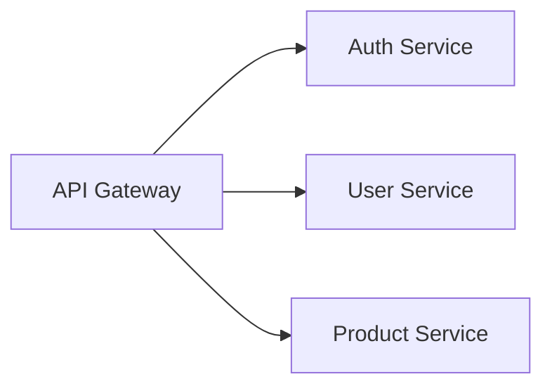

# 🎬 DIÁLOGO DE PRESENTACIÓN — Generación Automática de Documentación Técnica y Diagramas con Mermaid

## 📋 Información General

| Campo | Detalle |
|-------|---------|
| **Presentadores** | Daniel Felipe Melo y Angel Duran |
| **Duración Total** | 60 minutos |
| **Número de Slides** | 37 |
| **Formato** | Interactivo con demos en vivo |
| **Audiencia** | Desarrolladores, arquitectos, líderes técnicos |

---

## ⏱️ Distribución de Tiempo por Sección

| # | Sección | Slides | Tiempo | Presentador Principal |
|---|---------|--------|--------|----------------------|
| 1 | Documentación Automática | 1–3 | 6 min | Daniel |
| 2 | Introducción a Mermaid | 4–5 | 3 min | Angel |
| 3 | Fundamentos | 6–9 | 7 min | Daniel |
| 4 | Tipos de Diagramas | 10–16 | 10 min | Angel |
| 5 | Diagramas Avanzados | 17–20 | 7 min | Daniel |
| 6 | Configuración y Temas | 21–22 | 4 min | Angel |
| 7 | Editor Interactivo | 23 | 5 min | Daniel + Angel |
| 8 | Comparativa | 24–25 | 4 min | Daniel |
| 9 | Casos de Uso | 26–31 | 8 min | Angel |
| 10 | Mejores Prácticas | 32–36 | 4 min | Daniel |
| 11 | Cierre | 37 | 2 min | Daniel + Angel |
| | **TOTAL** | **37** | **60 min** | |

---

## 🎭 Leyenda de Marcadores Interactivos

| Emoji | Significado |
|-------|-------------|
| 🙋 | **[PREGUNTA AL PÚBLICO]** — Momento de interacción con la audiencia |
| 💻 | **[DEMO EN VIVO]** — Demostración práctica en pantalla |
| ⏸️ | **[PAUSA INTERACTIVA]** — Momento para reflexión o discusión |
| ✏️ | **[EJERCICIO]** — Actividad práctica para los asistentes |
| 🔄 | **[TRANSICIÓN]** — Cambio de sección o tema |
| 💡 | **Nota del presentador** — Tips internos |

---

## 📖 GUIÓN COMPLETO

---

### 🟢 SECCIÓN 1: Documentación Automática (Slides 1–3) — 6 min

---

#### Slide 1 — cover (1.5 min) | 🎤 Daniel

**Daniel:** ¡Buenos días/tardes a todos! Bienvenidos a esta sesión sobre **Generación Automática de Documentación Técnica y Diagramas**. Mi nombre es Daniel Felipe Melo y me acompaña Angel Duran. Juntos vamos a mostrarles cómo la combinación de IA y herramientas como Mermaid puede transformar la forma en que documentamos nuestros proyectos.

**Angel:** ¡Hola a todos! Estamos muy contentos de estar aquí. Esta presentación es completamente interactiva — vamos a hacer demos en vivo, ejercicios prácticos y queremos escuchar sus experiencias. Así que prepárense para participar.

🙋 **[PREGUNTA AL PÚBLICO]**

**Daniel:** Antes de arrancar, levanten la mano: ¿Cuántos de ustedes han tenido que documentar un sistema y la documentación ya estaba desactualizada cuando la terminaron?

*[Esperar respuestas — probablemente muchas manos]*

**Daniel:** Exacto. Ese es precisamente el problema que vamos a resolver hoy.

💡 *Nota: Establecer rapport desde el inicio. Si la audiencia es tímida, usar humor: "Si no levantan la mano, es porque ni siquiera intentaron documentar..."*

---

#### Slide 2 — auto-doc-intro (2.5 min) | 🎤 Daniel

**Daniel:** Veamos los números que respaldan por qué necesitamos automatizar. Según estudios de la industria:

- El **60% de la documentación técnica** está desactualizada en cualquier momento dado
- Los desarrolladores gastan hasta un **20% de su tiempo** buscando o creando documentación
- Con herramientas de IA, podemos generar documentación **10 veces más rápido**

**Daniel:** Piénsenlo así: si un equipo de 10 desarrolladores gasta 20% de su tiempo en documentación, eso son 2 desarrolladores completos dedicados solo a eso. ¿Y si pudiéramos recuperar ese tiempo?

🙋 **[PREGUNTA AL PÚBLICO]**

**Angel:** ¿Alguien aquí ha usado alguna herramienta de IA para generar documentación? ¿Copilot, ChatGPT, Claude? ¿Qué experiencia tuvieron?

*[Escuchar 2-3 respuestas breves]*

💡 *Nota: Validar las respuestas del público. Si mencionan problemas con IA, reconocerlos: "Exacto, la IA no es perfecta, pero con el flujo correcto..."*

---

#### Slide 3 — auto-doc-workflow (2 min) | 🎤 Angel

**Angel:** Aquí es donde se pone interesante. Este es el pipeline que proponemos:

**Código → IA → Mermaid → Git → CI/CD → Documentación Publicada**

Cada paso es automático:
1. El código cambia en el repositorio
2. La IA analiza los cambios y genera diagramas Mermaid
3. Los diagramas se versionan en Git junto al código
4. El CI/CD renderiza los diagramas
5. La documentación se publica actualizada

**Angel:** La clave aquí es que la documentación **vive junto al código**. No es un documento de Word perdido en SharePoint. Es código que genera diagramas.

🔄 **[TRANSICIÓN]**

**Angel:** Y la pieza central de este pipeline es **Mermaid**. Vamos a conocerlo a fondo.

---

### 🟢 SECCIÓN 2: Introducción a Mermaid (Slides 4–5) — 3 min

---

#### Slide 4 — intro (1.5 min) | 🎤 Angel

**Angel:** Mermaid es una herramienta de **diagramación inteligente** basada en texto. La idea es simple pero poderosa:

**Texto → Mermaid → Diagrama**

Escribes texto con una sintaxis sencilla, y Mermaid lo convierte en diagramas profesionales. Sin arrastrar cajitas, sin alinear flechas manualmente, sin perder 30 minutos ajustando un diagrama en Visio.

**Daniel:** Y lo mejor: ese texto se puede versionar en Git, revisar en pull requests, y generar automáticamente con IA. Es el eslabón perfecto en nuestro pipeline de documentación automática.

💡 *Nota: Enfatizar que Mermaid es GRATUITO y open source.*

---

#### Slide 5 — table-of-contents (1.5 min) | 🎤 Daniel

**Daniel:** Este es nuestro recorrido para la próxima hora. Vamos a cubrir 9 secciones:

1. **Fundamentos** — Qué es y cómo funciona
2. **Tipos de Diagramas** — Los 7 tipos principales
3. **Diagramas Avanzados** — Mindmaps, timelines, gitgraph
4. **Configuración y Temas** — Personalización
5. **Editor Interactivo** — Práctica en vivo
6. **Comparativa** — Mermaid vs otras herramientas
7. **Casos de Uso** — Aplicaciones reales
8. **Mejores Prácticas** — Tips profesionales
9. **Cierre** — Recursos y próximos pasos

**Daniel:** Vamos a ir alternando entre teoría, demos y ejercicios. Si en algún momento tienen preguntas, no duden en interrumpirnos.

---

### 🟢 SECCIÓN 3: Fundamentos (Slides 6–9) — 7 min

---

#### Slide 6 — what-is-mermaid (2 min) | 🎤 Daniel

**Daniel:** Mermaid es una librería JavaScript open source creada por Knut Sveidqvist. Permite generar diagramas y visualizaciones a partir de texto, usando una sintaxis inspirada en Markdown.

Características clave:
- **Open source** y gratuito
- Renderiza en el **navegador** (no necesita servidor)
- Soportado nativamente en **GitHub**, **GitLab**, **Notion**, **Confluence**
- Más de **60,000 estrellas** en GitHub
- Comunidad activa y en constante evolución

🙋 **[PREGUNTA AL PÚBLICO]**

**Daniel:** ¿Cuántos ya han visto diagramas Mermaid en un README de GitHub? Desde 2022, GitHub los renderiza nativamente en archivos Markdown.

💡 *Nota: Si la audiencia no conoce Mermaid, ir más despacio en esta sección. Si ya lo conocen, avanzar rápido a los ejemplos.*

---

#### Slide 7 — basic-syntax (2 min) | 🎤 Daniel

💻 **[DEMO EN VIVO]**

**Daniel:** Veamos la sintaxis básica. Un diagrama de flujo simple se escribe así:

```
graph TD
    A[Inicio] --> B{¿Condición?}
    B -->|Sí| C[Acción 1]
    B -->|No| D[Acción 2]
    C --> E[Fin]
    D --> E
```

Desglosemos:
- `graph TD` — Tipo de diagrama (graph) y dirección (Top-Down)
- `A[Inicio]` — Nodo con forma rectangular
- `B{¿Condición?}` — Nodo con forma de diamante (decisión)
- `-->` — Flecha de conexión
- `-->|texto|` — Flecha con etiqueta

**Daniel:** Con 6 líneas de texto, tenemos un diagrama de flujo completo. Comparen eso con hacerlo en PowerPoint o Visio.

💡 *Nota: Mostrar el diagrama renderizado en la presentación. Señalar cada parte del código y su resultado visual.*

---

#### Slide 8 — advantages (1.5 min) | 🎤 Angel

**Angel:** ¿Por qué elegir Mermaid sobre otras herramientas? Las ventajas principales:

✅ **Versionable** — Es texto plano, vive en Git
✅ **Reproducible** — El mismo código siempre genera el mismo diagrama
✅ **Colaborativo** — Se puede revisar en PRs como cualquier código
✅ **Automatizable** — Perfecto para CI/CD y generación con IA
✅ **Portable** — Funciona en cualquier navegador
✅ **Accesible** — No necesitas licencias costosas

**Angel:** En resumen: trata los diagramas como código. El mismo principio de "Infrastructure as Code" pero aplicado a la documentación.

---

#### Slide 9 — rendering-architecture (1.5 min) | 🎤 Angel

**Angel:** ¿Cómo funciona internamente? El pipeline de renderizado es:

1. **Parser** — Lee el texto Mermaid y genera un AST
2. **Renderer** — Convierte el AST en instrucciones SVG
3. **Layout Engine** (dagre/elk) — Calcula posiciones de nodos
4. **SVG Output** — Genera el diagrama final

Todo esto ocurre en el navegador, en milisegundos. No hay servidor involucrado.

**Angel:** Esto es importante porque significa que pueden integrar Mermaid en cualquier aplicación web sin dependencias externas.

🔄 **[TRANSICIÓN]**

**Daniel:** Ahora que entendemos los fundamentos, vamos a ver todos los tipos de diagramas que Mermaid soporta. Angel, te toca.

---

### 🟢 SECCIÓN 4: Tipos de Diagramas (Slides 10–16) — 10 min

---

#### Slide 10 — flowchart (1.5 min) | 🎤 Angel

💻 **[DEMO EN VIVO]**

**Angel:** Empecemos con el más común: **Diagramas de Flujo**. Ya vimos la sintaxis básica, pero hay mucho más:

- Direcciones: `TD` (arriba-abajo), `LR` (izquierda-derecha), `BT`, `RL`
- Formas: `[]` rectángulo, `{}` diamante, `()` redondeado, `[()]` cilindro, `[[]]` subrutina
- Estilos de flecha: `-->` sólida, `-.->` punteada, `==>` gruesa
- Subgrafos para agrupar nodos

**Angel:** Los flowcharts son ideales para documentar procesos de negocio, flujos de aprobación, y lógica de decisión.

💡 *Nota: Mostrar el diagrama renderizado. Señalar las diferentes formas de nodos.*

---

#### Slide 11 — sequence-diagram (1.5 min) | 🎤 Angel

**Angel:** Los **Diagramas de Secuencia** son mis favoritos para documentar APIs y microservicios. Muestran la interacción entre actores a lo largo del tiempo:

```
sequenceDiagram
    Cliente->>+API: POST /login
    API->>+Auth: Validar credenciales
    Auth-->>-API: Token JWT
    API-->>-Cliente: 200 OK + Token
```

Elementos clave:
- `->>` mensaje síncrono
- `-->>` respuesta
- `+/-` activación/desactivación de participante
- `Note`, `loop`, `alt` para anotaciones y control de flujo

🙋 **[PREGUNTA AL PÚBLICO]**

**Angel:** ¿Quién documenta sus APIs con diagramas de secuencia actualmente? ¿Qué herramienta usan?

---

#### Slide 12 — class-diagram (1.5 min) | 🎤 Angel

**Angel:** Para los que trabajan con orientación a objetos, los **Diagramas de Clases** son esenciales:

```
classDiagram
    class Animal {
        +String nombre
        +int edad
        +hacerSonido() void
    }
    Animal <|-- Perro
    Animal <|-- Gato
```

Soporta:
- Herencia, composición, agregación
- Visibilidad (+, -, #, ~)
- Métodos y atributos
- Interfaces y clases abstractas

**Angel:** Perfecto para documentar modelos de dominio y patrones de diseño.

---

#### Slide 13 — state-diagram (1.5 min) | 🎤 Angel

**Angel:** Los **Diagramas de Estado** modelan el ciclo de vida de una entidad:

```
stateDiagram-v2
    [*] --> Pendiente
    Pendiente --> EnProceso: iniciar
    EnProceso --> Completado: finalizar
    EnProceso --> Cancelado: cancelar
    Completado --> [*]
```

**Angel:** Ideales para documentar máquinas de estado, flujos de órdenes, estados de tickets, o cualquier entidad con un ciclo de vida definido.

---

#### Slide 14 — gantt-diagram (1.5 min) | 🎤 Daniel

**Daniel:** Los **Diagramas de Gantt** son perfectos para planificación de proyectos:

```
gantt
    title Sprint 15
    dateFormat YYYY-MM-DD
    section Backend
    API Users     :a1, 2024-01-01, 5d
    API Products  :a2, after a1, 3d
    section Frontend
    UI Login      :b1, 2024-01-01, 4d
    UI Dashboard  :b2, after b1, 6d
```

**Daniel:** Pueden documentar sprints, roadmaps, o planes de migración directamente en el repositorio.

---

#### Slide 15 — er-diagram (1 min) | 🎤 Daniel

**Daniel:** Los **Diagramas Entidad-Relación** documentan modelos de datos:

```
erDiagram
    USUARIO ||--o{ ORDEN : realiza
    ORDEN ||--|{ PRODUCTO : contiene
    USUARIO {
        int id PK
        string nombre
        string email
    }
```

**Daniel:** Cardinalidad, atributos, claves primarias — todo lo que necesitan para documentar su base de datos.

---

#### Slide 16 — pie-chart (1 min) | 🎤 Daniel

**Daniel:** Y para datos simples, los **Diagramas de Pastel**:

```
pie title Distribución de Bugs
    "Frontend" : 35
    "Backend" : 45
    "Infra" : 20
```

**Daniel:** Simples pero efectivos para reportes y dashboards de documentación.

🔄 **[TRANSICIÓN]**

**Daniel:** Esos son los 7 tipos básicos. Ahora vamos con los diagramas avanzados que Mermaid ha agregado recientemente.

---


### 🟢 SECCIÓN 5: Diagramas Avanzados (Slides 17–20) — 7 min

---

#### Slide 17 — mindmap-diagram (2 min) | 🎤 Daniel

**Daniel:** Los **Mapas Mentales** son una adición relativamente nueva y muy poderosa:

```
mindmap
  root((Proyecto))
    Frontend
      React
      TypeScript
      Tailwind
    Backend
      Node.js
      Express
      PostgreSQL
    DevOps
      Docker
      Kubernetes
      GitHub Actions
```

**Daniel:** Perfectos para brainstorming, documentar arquitectura de alto nivel, o mapear dependencias de un proyecto.

⏸️ **[PAUSA INTERACTIVA]**

**Daniel:** Piensen en su proyecto actual. ¿Cómo se vería un mindmap de su arquitectura? ¿Cuántas ramas principales tendrían?

*[Dar 15 segundos para que piensen]*

💡 *Nota: Si hay tiempo, pedir a 1-2 personas que describan su mindmap verbalmente.*

---

#### Slide 18 — timeline-diagram (1.5 min) | 🎤 Daniel

**Daniel:** Las **Líneas de Tiempo** son excelentes para documentar evolución:

```
timeline
    title Historia del Proyecto
    2022 : Inicio del proyecto
         : Primer MVP
    2023 : Migración a microservicios
         : 100K usuarios
    2024 : Implementación IA
         : Documentación automática
```

**Daniel:** Úsenlas para roadmaps, historiales de incidentes, o evolución de arquitectura.

---

#### Slide 19 — gitgraph-diagram (2 min) | 🎤 Daniel

💻 **[DEMO EN VIVO]**

**Daniel:** Este es uno de mis favoritos: **GitGraph**. Documenta estrategias de branching:

```
gitGraph
    commit
    branch develop
    checkout develop
    commit
    branch feature/login
    checkout feature/login
    commit
    commit
    checkout develop
    merge feature/login
    checkout main
    merge develop tag:"v1.0"
```

**Daniel:** Ideal para documentar su estrategia de Git Flow, trunk-based development, o cualquier modelo de branching del equipo.

🙋 **[PREGUNTA AL PÚBLICO]**

**Daniel:** ¿Qué estrategia de branching usan en sus equipos? ¿Git Flow, trunk-based, GitHub Flow?

*[Escuchar 2-3 respuestas]*

---

#### Slide 20 — quadrant-diagram (1.5 min) | 🎤 Angel

**Angel:** Los **Diagramas de Cuadrante** son perfectos para análisis y priorización:

```
quadrantChart
    title Priorización de Features
    x-axis Bajo Esfuerzo --> Alto Esfuerzo
    y-axis Bajo Impacto --> Alto Impacto
    quadrant-1 Hacer Primero
    quadrant-2 Planificar
    quadrant-3 Delegar
    quadrant-4 Eliminar
    Login Social: [0.3, 0.8]
    Dark Mode: [0.2, 0.3]
    Migración DB: [0.9, 0.9]
```

**Angel:** Matrices de Eisenhower, análisis de riesgo, priorización de backlog — todo con texto plano.

🔄 **[TRANSICIÓN]**

**Angel:** Ya conocemos todos los tipos de diagramas. Ahora veamos cómo personalizarlos.

---

### 🟢 SECCIÓN 6: Configuración y Temas (Slides 21–22) — 4 min

---

#### Slide 21 — themes-config (2 min) | 🎤 Angel

**Angel:** Mermaid viene con temas predefinidos que cambian completamente la apariencia:

- **default** — Colores estándar
- **dark** — Para fondos oscuros
- **forest** — Tonos verdes naturales
- **neutral** — Minimalista, ideal para documentación formal
- **base** — Para personalización completa

```
%%{init: {'theme': 'forest'}}%%
graph TD
    A --> B --> C
```

**Angel:** También pueden definir colores personalizados con variables CSS. Esto es clave para mantener consistencia con la identidad visual de su empresa.

💻 **[DEMO EN VIVO]**

**Angel:** Voy a cambiar el tema en vivo para que vean la diferencia...

*[Mostrar el mismo diagrama con 2-3 temas diferentes]*

---

#### Slide 22 — directives-config (2 min) | 🎤 Angel

**Angel:** Para control más fino, usamos **directivas**:

```
%%{init: {
  'theme': 'base',
  'themeVariables': {
    'primaryColor': '#1a73e8',
    'primaryTextColor': '#fff',
    'lineColor': '#333',
    'fontSize': '16px'
  }
}}%%
```

Directivas útiles:
- `flowchart: { curve: 'basis' }` — Tipo de curva en flechas
- `sequence: { mirrorActors: false }` — Configuración de secuencia
- `gantt: { barHeight: 30 }` — Altura de barras

**Angel:** Con directivas pueden adaptar Mermaid a cualquier guía de estilo corporativa.

🔄 **[TRANSICIÓN]**

**Daniel:** Suficiente teoría. ¡Es hora de que ustedes escriban Mermaid!

---

### 🟢 SECCIÓN 7: Editor Interactivo (Slide 23) — 5 min

---

#### Slide 23 — editor-playground (5 min) | 🎤 Daniel + Angel

✏️ **[EJERCICIO]**

**Daniel:** Esta slide tiene un editor interactivo integrado. Vamos a hacer un ejercicio juntos.

**Daniel:** El reto es simple: tienen 3 minutos para crear un diagrama que represente algún proceso de su trabajo diario. Puede ser:
- Un flujo de despliegue
- Una interacción entre servicios
- Un proceso de aprobación
- Lo que quieran

**Angel:** Pueden usar el editor en la presentación o abrir [mermaid.live](https://mermaid.live) en su navegador. Les doy un template para empezar:

```
graph LR
    A[Su Proceso] --> B[Paso 1]
    B --> C[Paso 2]
    C --> D[Resultado]
```

💻 **[DEMO EN VIVO]**

**Daniel:** Mientras trabajan, voy a crear uno en vivo. Voy a documentar nuestro proceso de code review...

*[Daniel escribe un diagrama en vivo mientras la audiencia trabaja]*

⏸️ **[PAUSA INTERACTIVA]** — 3 minutos de trabajo

**Angel:** ¿Alguien quiere compartir su diagrama? No tiene que ser perfecto, la idea es practicar.

*[Invitar a 1-2 voluntarios a mostrar su pantalla o describir su diagrama]*

💡 *Nota: Tener preparado un diagrama de respaldo por si nadie se anima. Celebrar cualquier intento: "¡Excelente! Miren cómo en 3 minutos ya tienen un diagrama funcional."*

**Daniel:** ¿Ven lo rápido que es? Imaginen esto integrado en su pipeline de CI/CD, generándose automáticamente cada vez que el código cambia.

🔄 **[TRANSICIÓN]**

**Angel:** Ahora que ya saben usar Mermaid, comparémoslo con las alternativas.

---

### 🟢 SECCIÓN 8: Comparativa (Slides 24–25) — 4 min

---

#### Slide 24 — comparison (2 min) | 🎤 Daniel

**Daniel:** ¿Cómo se compara Mermaid con otras herramientas? Veamos las 6 principales:

| Herramienta | Tipo | Costo | Git-friendly |
|-------------|------|-------|--------------|
| **Mermaid** | Texto → Diagrama | Gratis | ✅ Sí |
| **PlantUML** | Texto → Diagrama | Gratis | ✅ Sí |
| **Draw.io** | Visual (drag & drop) | Gratis | ⚠️ XML |
| **Lucidchart** | Visual (SaaS) | Pago | ❌ No |
| **Visio** | Visual (desktop) | Pago | ❌ No |
| **D2** | Texto → Diagrama | Gratis | ✅ Sí |

**Daniel:** Las herramientas basadas en texto (Mermaid, PlantUML, D2) son las únicas que se integran naturalmente con Git y CI/CD.

---

#### Slide 25 — comparison-table (2 min) | 🎤 Daniel

**Daniel:** Profundicemos en la comparación:

**Mermaid gana en:**
- Soporte nativo en GitHub/GitLab (sin plugins)
- Curva de aprendizaje más baja
- Ecosistema JavaScript (fácil de integrar en web)
- Comunidad más grande y activa

**PlantUML gana en:**
- Más tipos de diagramas UML
- Más opciones de personalización
- Mejor para diagramas muy complejos

**D2 gana en:**
- Sintaxis más moderna
- Mejor layout engine
- Soporte para diagramas interactivos

**Daniel:** Nuestra recomendación: Mermaid para el 80% de los casos. PlantUML si necesitan UML estricto. D2 si buscan lo más moderno.

🙋 **[PREGUNTA AL PÚBLICO]**

**Daniel:** ¿Alguien ha usado PlantUML o D2? ¿Qué opinan comparado con lo que han visto de Mermaid?

---

### 🟢 SECCIÓN 9: Casos de Uso (Slides 26–31) — 8 min

---

#### Slide 26 — use-case-docs (1.5 min) | 🎤 Angel

**Angel:** Caso de uso #1: **Documentación Técnica y README**

El uso más directo: incluir diagramas en sus archivos Markdown. En GitHub, solo necesitan:

````markdown

````

**Angel:** Se renderiza automáticamente. No hay que generar imágenes, no hay que mantener archivos PNG desactualizados. El diagrama ES el código.

---

#### Slide 27 — use-case-ai (1.5 min) | 🎤 Angel

**Angel:** Caso de uso #2: **Generación con Inteligencia Artificial**

Aquí es donde todo se conecta con el tema principal de la presentación. Pueden pedirle a cualquier LLM:

> "Analiza este código y genera un diagrama de secuencia Mermaid que muestre el flujo de autenticación"

Y la IA genera el código Mermaid listo para usar. Herramientas como:
- **GitHub Copilot** — Genera diagramas inline
- **ChatGPT / Claude** — Análisis de código → diagramas
- **Scripts personalizados** — Integración con APIs de IA

**Angel:** La IA entiende Mermaid perfectamente porque es texto estructurado. Es mucho más fácil para un LLM generar texto Mermaid que generar una imagen.

---

#### Slide 28 — use-case-platforms (1 min) | 🎤 Angel

**Angel:** Caso de uso #3: **Plataformas Colaborativas**

Mermaid está soportado nativamente en:
- **GitHub** — README, Issues, PRs, Wikis
- **GitLab** — Markdown en todo el sistema
- **Notion** — Bloques de código Mermaid
- **Confluence** — Con plugin oficial
- **Obsidian** — Notas con diagramas
- **VS Code** — Preview en tiempo real

**Angel:** Donde sea que su equipo colabore, Mermaid probablemente ya está disponible.

---

#### Slide 29 — use-case-cicd (1.5 min) | 🎤 Angel

💻 **[DEMO EN VIVO]**

**Angel:** Caso de uso #4: **CI/CD y Arquitectura de Despliegue**

Pueden automatizar la generación de diagramas en su pipeline:

```yaml
# .github/workflows/docs.yml
- name: Generate Architecture Diagram
  run: |
    npx @mermaid-js/mermaid-cli mmdc \
      -i docs/architecture.mmd \
      -o docs/architecture.svg
```

**Angel:** Cada vez que el código cambia, el diagrama se regenera. Documentación que nunca se desactualiza.

---

#### Slide 30 — use-case-onboarding (1 min) | 🎤 Daniel

**Daniel:** Caso de uso #5: **Onboarding de Desarrolladores**

¿Cuánto tiempo tarda un nuevo desarrollador en entender su sistema? Con diagramas Mermaid actualizados en el repo:

- **Día 1:** Lee el README con diagrama de arquitectura general
- **Día 2:** Explora diagramas de secuencia de los flujos principales
- **Día 3:** Revisa diagramas de clases del dominio

**Daniel:** En lugar de semanas descifrando código, días entendiendo el sistema visualmente.

---

#### Slide 31 — use-case-architecture (1.5 min) | 🎤 Daniel

**Daniel:** Caso de uso #6: **Documentación de Arquitectura**

Este diagrama muestra una arquitectura de microservicios completa documentada con Mermaid. Incluye:
- API Gateway
- Servicios internos
- Bases de datos
- Colas de mensajes
- Servicios externos

**Daniel:** Todo en un archivo de texto que cualquier desarrollador puede actualizar en un PR. No necesitan acceso a Confluence ni permisos especiales.

🔄 **[TRANSICIÓN]**

**Daniel:** Ya saben qué es Mermaid, cómo usarlo, y dónde aplicarlo. Ahora las mejores prácticas para hacerlo profesionalmente.

---

### 🟢 SECCIÓN 10: Mejores Prácticas (Slides 32–36) — 4 min

---

#### Slide 32 — best-practices (1 min) | 🎤 Daniel

**Daniel:** Reglas de oro para diagramas Mermaid profesionales:

1. **Un diagrama, un propósito** — No intenten meter todo en un solo diagrama
2. **Máximo 15-20 nodos** — Si tiene más, divídanlo
3. **Nombres descriptivos** — `authService` no `A`
4. **Comentarios** — Usen `%%` para explicar decisiones
5. **Consistencia** — Misma dirección y estilo en todo el proyecto

---

#### Slide 33 — best-practices-naming (1 min) | 🎤 Daniel

**Daniel:** Convenciones de nombrado que recomendamos:

```
%% ✅ Bueno
graph LR
    apiGateway[API Gateway] --> authService[Auth Service]
    authService --> userDB[(User Database)]

%% ❌ Malo
graph LR
    A[API] --> B[Auth]
    B --> C[DB]
```

**Daniel:** Los IDs descriptivos hacen que el código sea legible sin necesidad de ver el diagrama renderizado. Esto es crucial cuando la IA genera o modifica diagramas.

---

#### Slide 34 — best-practices-maintenance (0.5 min) | 🎤 Daniel

**Daniel:** Para mantenimiento y gobernanza:

- Definan un **owner** por diagrama (como CODEOWNERS)
- Revisen diagramas en **code review** como cualquier código
- Establezcan una **cadencia de revisión** (ej: cada sprint)
- Usen **linters** para validar sintaxis Mermaid en CI

---

#### Slide 35 — integration-git (1 min) | 🎤 Daniel

**Daniel:** Integración con Git y CI/CD:

- **Pre-commit hooks** — Validar sintaxis antes de commit
- **GitHub Actions** — Renderizar y publicar automáticamente
- **PR previews** — Mostrar diagramas renderizados en PRs
- **Mermaid CLI** (`mmdc`) — Para renderizado en pipelines

```bash
# Validar todos los archivos .mmd
npx @mermaid-js/mermaid-cli mmdc -i diagram.mmd -o output.svg
```

---

#### Slide 36 — tips-performance (0.5 min) | 🎤 Daniel

**Daniel:** Limitaciones a tener en cuenta:

- **Rendimiento** — Diagramas con +50 nodos pueden ser lentos
- **Layout** — No siempre el auto-layout es perfecto
- **Personalización** — Menos flexible que herramientas visuales
- **Curva** — Diagramas muy complejos requieren práctica

**Daniel:** La solución: dividir diagramas grandes en múltiples diagramas pequeños y enfocados.

🔄 **[TRANSICIÓN]**

**Angel:** ¡Y llegamos al final! Vamos a cerrar con un resumen y recursos.

---

### 🟢 SECCIÓN 11: Cierre (Slide 37) — 2 min

---

#### Slide 37 — closing (2 min) | 🎤 Daniel + Angel

**Daniel:** Hagamos un resumen rápido de lo que cubrimos hoy:

✅ La documentación automática es posible y necesaria
✅ Mermaid es la herramienta ideal: texto → diagramas → Git
✅ Soporta +10 tipos de diagramas para cualquier necesidad
✅ Se integra con GitHub, GitLab, CI/CD, y herramientas de IA
✅ Con buenas prácticas, la documentación se mantiene sola

**Angel:** Recursos para seguir aprendiendo:

📚 **Documentación oficial:** [mermaid.js.org](https://mermaid.js.org)
🎮 **Editor en línea:** [mermaid.live](https://mermaid.live)
💻 **CLI:** `npm install @mermaid-js/mermaid-cli`
📖 **GitHub:** [github.com/mermaid-js/mermaid](https://github.com/mermaid-js/mermaid)

🙋 **[PREGUNTA AL PÚBLICO]**

**Angel:** ¿Preguntas? ¿Algo que quieran profundizar? Estamos aquí para ayudarles a implementar esto en sus equipos.

*[Espacio para 2-3 preguntas finales]*

**Daniel:** ¡Gracias a todos por su tiempo y participación! Si quieren seguir la conversación, nos encuentran en los canales del equipo.

**Angel:** ¡Éxito implementando Mermaid en sus proyectos! Recuerden: la mejor documentación es la que se genera sola. 🚀

---

## ✅ CHECKLIST DEL PRESENTADOR

### Antes de la Presentación

- [ ] Verificar que la presentación carga correctamente en el navegador
- [ ] Probar el editor interactivo (Slide 23)
- [ ] Tener [mermaid.live](https://mermaid.live) abierto como respaldo
- [ ] Verificar conexión a internet (para demos)
- [ ] Preparar diagrama de respaldo para el ejercicio
- [ ] Tener agua disponible
- [ ] Verificar micrófono y proyector
- [ ] Acordar señales entre Daniel y Angel para transiciones
- [ ] Tener timer visible (teléfono o reloj)
- [ ] Cargar la presentación en modo pantalla completa

### Durante la Presentación

- [ ] Mantener contacto visual con la audiencia
- [ ] Respetar los tiempos por sección
- [ ] Si una demo falla, pasar al siguiente punto sin detenerse
- [ ] Alternar entre presentadores según el guión
- [ ] Fomentar participación en los momentos marcados con 🙋
- [ ] Si hay preguntas fuera de tema, anotar y responder al final

### Después de la Presentación

- [ ] Compartir link de la presentación con los asistentes
- [ ] Enviar recursos adicionales por correo/chat
- [ ] Recopilar feedback
- [ ] Documentar preguntas que surgieron para futuras sesiones

---

## 💡 TIPS PARA LOS PRESENTADORES

### Para Daniel

- Eres el presentador principal en las secciones técnicas (Fundamentos, Avanzados, Mejores Prácticas)
- Tu fortaleza: explicaciones claras y demos en vivo
- Tip: Si el código no funciona en la demo, ten un screenshot preparado
- Mantén el ritmo en la sección de tipos de diagramas — es fácil extenderse

### Para Angel

- Eres el presentador principal en Tipos de Diagramas y Casos de Uso
- Tu fortaleza: conectar con la audiencia y dar contexto práctico
- Tip: Usa ejemplos reales del equipo cuando sea posible
- En las preguntas al público, si nadie responde, ten una anécdota lista

### Manejo del Tiempo

| Señal | Acción |
|-------|--------|
| ⏰ -5 min en sección | Empezar a cerrar el punto actual |
| ⏰ -10 min total | Saltar directamente al cierre si es necesario |
| ⏰ Pregunta larga | "Excelente pregunta, la anotamos para el final" |
| ⏰ Demo falla | "Les muestro el resultado esperado" (screenshot) |

### Manejo de Situaciones

| Situación | Respuesta |
|-----------|-----------|
| Nadie participa | Hacer la pregunta más específica o contar una anécdota |
| Demasiadas preguntas | "Anotamos las preguntas y las respondemos al final" |
| Problema técnico | Angel toma la palabra mientras Daniel resuelve (o viceversa) |
| Se acaba el tiempo | Saltar a Slide 37 (cierre) y compartir recursos |
| Audiencia avanzada | Profundizar en configuración y CI/CD |
| Audiencia principiante | Más tiempo en fundamentos y ejercicio práctico |

### Frases Útiles para Transiciones

- "Ahora que entendemos X, veamos cómo se aplica en Y..."
- "Angel, ¿quieres tomar esta parte?"
- "Esto conecta directamente con lo que vimos antes..."
- "Vamos a verlo en acción..."
- "¿Alguna duda hasta aquí antes de continuar?"

---

## 📊 RESUMEN DE INTERACCIONES

| Tipo | Cantidad | Slides |
|------|----------|--------|
| 🙋 Preguntas al público | 7 | 1, 2, 11, 19, 25, 37 |
| 💻 Demos en vivo | 5 | 7, 10, 19, 21, 29 |
| ⏸️ Pausas interactivas | 2 | 17, 23 |
| ✏️ Ejercicios | 1 | 23 |
| 🔄 Transiciones | 6 | 3, 9, 16, 22, 31, 36 |

---

*Documento generado para la presentación de 37 slides. Duración total: 60 minutos.*
*Presentadores: Daniel Felipe Melo y Angel Duran.*
