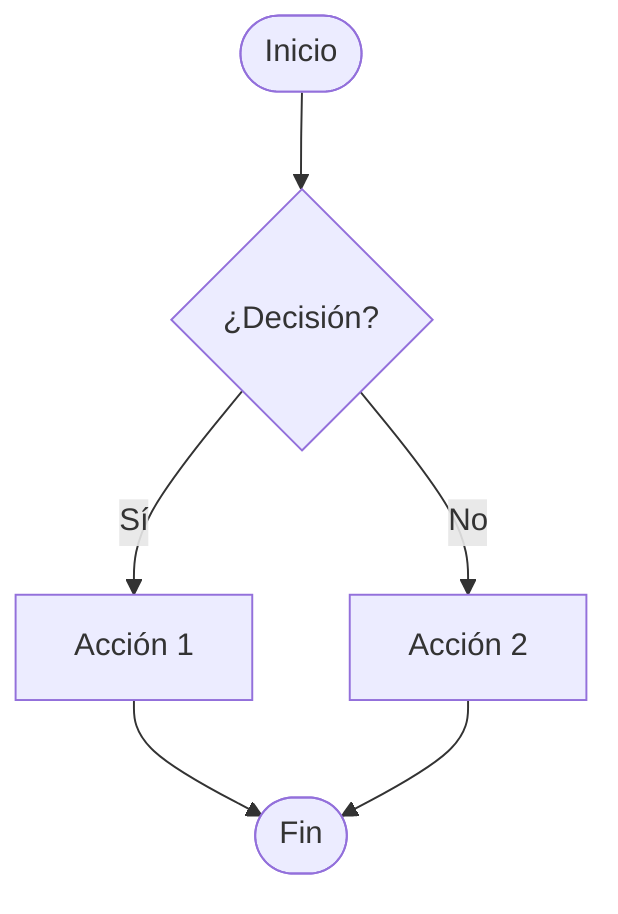

# ✏️ Ejercicio Práctico

Copia el código, modifícalo y pega tu resultado en el chat.

---

## Ejemplo para modificar

---

## Tu turno

Cambia los textos o adiciona algo de lo que se vio en la session.
